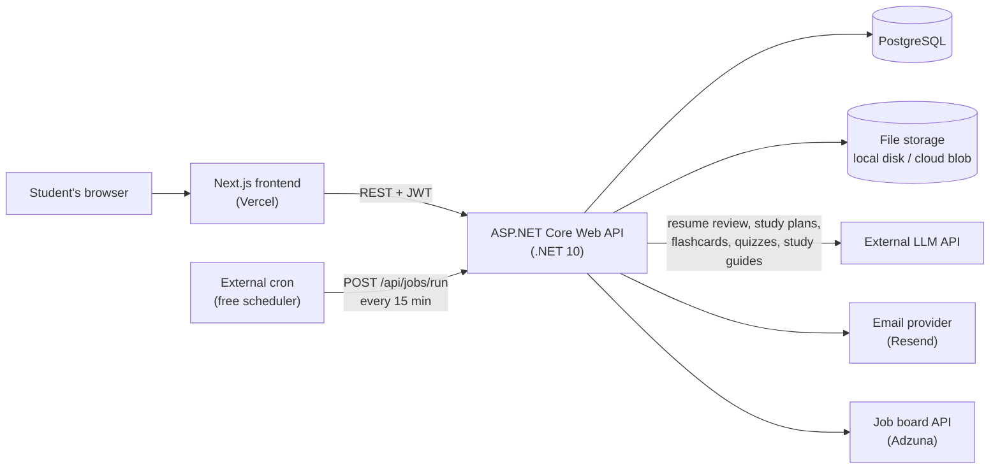

# PursuitHQ — Architecture

## 1. System Overview



The frontend never talks to the database, file storage, or the AI provider directly. Everything goes through the API, which is the only place that holds credentials.

## 2. Backend Layers

Requests flow in one direction, and each layer has one job:

```
HTTP request
   ↓
Controller      validates input, reads the user id from the JWT, maps DTO ↔ entity
   ↓
Service         business logic, AI calls, file storage operations
   ↓
DbContext       Entity Framework Core queries
   ↓
PostgreSQL
```

**Rules**
- Controllers contain no business logic and no direct file/AI calls.
- Services never accept or return DTOs — they work with entities and domain types.
- Entities never leave the API; controllers always map to DTOs first.
- Every query is filtered by the authenticated user's id. No exceptions.

## 3. Project Structure

```
PursuitHQ.API
├── Controllers      AuthController, CoursesController, AssignmentsController,
│                    MaterialsController, NotesController, FoldersController,
│                    StudySessionsController, ApplicationsController,
│                    ResumesController, GoalsController, SkillsController,
│                    CertificationsController, DashboardController,
│                    CalendarController, StudyToolsController,
│                    JobSearchController, NotificationsController, JobsController
├── Models           Entity classes (see DatabaseDesign.md)
├── DTOs             Request/response shapes, one folder per feature
├── Services         IFileStorageService, LocalFileStorageService,
│                    ITextExtractionService, IEmailService, NotificationService,
│                    IAiService, GeminiAiService, IJobSearchService, ResumeAiService,
│                    StudyPlannerAiService, StudyToolAiService
├── Data             ApplicationDbContext, seed data
├── Migrations       EF Core migrations (generated)
├── Program.cs       Service registration and middleware pipeline
└── appsettings.json Non-secret configuration
```

## 4. File Storage Design

Uploaded study materials are **not** stored in PostgreSQL. The database stores metadata; the bytes go to storage behind an interface:

```csharp
public interface IFileStorageService
{
    Task<string> SaveAsync(Stream content, string contentType);   // returns StoredPath
    Task<Stream> OpenAsync(string storedPath);
    Task DeleteAsync(string storedPath);
}
```

- **Development:** `LocalFileStorageService` writes to a configured folder outside `wwwroot` (so files are never served statically — every download goes through an authorized endpoint).
- **Production:** swap in an Azure Blob or S3 implementation. Nothing else changes: no entity, controller, or migration is affected.

**Upload pipeline**
1. Check `Content-Length` against the configured max (reject with 413 before reading the body).
2. Validate the content type against the allow-list (reject with 415).
3. Generate a GUID-based `StoredPath` — never trust or reuse the client's file name on disk.
4. Write the file, then insert the `StudyMaterial` row. If the DB insert fails, delete the orphaned file.
5. On delete, remove the DB row first, then the file. Log and retry orphaned files rather than failing the request.

**Download pipeline**
Every download hits an authorized endpoint that loads the record, confirms the caller owns it, then streams from storage with the original `FileName` as the download name.

## 5. AI Service Design

Both AI features follow the same shape, so they share one pattern:

```
Controller  →  *AiService  →  build prompt from the user's own data
                           →  call LLM API (key from configuration, never client-side)
                           →  parse structured response
                           →  return suggestions (nothing persisted yet)
Controller  →  returns suggestions to the client for review
Client      →  user accepts  →  separate endpoint persists the accepted items
```

**`ResumeAiService`** — input: one resume's content. Output: section-level suggestions with the original text, the proposed text, and a reason. Stored resume is untouched until the user accepts.

**`StudyPlannerAiService`** — input: courses, upcoming assignment due dates, existing sessions, and a date range. Output: suggested study sessions. Saved with `IsAiGenerated = true` only on acceptance.

**Shared rules**
- API keys live in configuration/secrets, never in the frontend or in source control.
- Every AI endpoint is rate-limited per user (see Security.md) to bound spend.
- Every AI call has a timeout; on failure the endpoint returns a readable error and changes nothing.
- Prompts include only the requesting user's own data.

## 5a. Background Jobs & Email Reminders

Reminders need something to run on a schedule. The obvious approach — a .NET `BackgroundService` or Hangfire running inside the API — **does not work reliably on free hosting**, because free tiers sleep when idle and a sleeping process runs no timers.

So the schedule lives outside the app:

```
Free cron service (cron-job.org / UptimeRobot)
        │  every 15 minutes
        │  POST /api/jobs/run   header: X-Scheduler-Secret
        ▼
JobsController  →  verifies the shared secret (401 otherwise)
                →  NotificationService.ProcessDueRemindersAsync()
                        ├─ find assignments due within each user's reminder window
                        ├─ find events starting within each user's reminder window
                        ├─ find users whose local digest time just passed
                        ├─ skip anything already in Notification (no duplicates)
                        ├─ IEmailService.SendAsync(...)
                        └─ write a Notification row per send (Sent or Failed)
```

**Why this design**
- Works identically on free and paid hosting — no rewrite when you upgrade.
- Pinging the API every 15 minutes also keeps the free instance warm, solving two problems at once.
- The endpoint is authenticated by a shared secret from configuration, never exposed to the frontend, and is the only endpoint that acts across all users.

**Rules**
- The job is idempotent: running it twice sends nothing twice, because `Notification` records what already went out.
- One user's failed email never aborts the run.
- Each user's reminder times are computed in their own `TimeZone`, not the server's.
- If you later move to paid always-on hosting, Hangfire or Quartz.NET can replace the cron trigger without changing `NotificationService`.

## 5b. Text Extraction for AI Study Tools

Before any uploaded file can become flashcards, a quiz, or a study guide, its text has to come out of it:

| Format | Library |
|---|---|
| PDF | PdfPig or iText7 |
| DOCX, PPTX | DocumentFormat.OpenXml (Open XML SDK) |
| TXT, MD | Read directly |

```csharp
public interface ITextExtractionService
{
    bool CanExtract(string contentType);
    Task<string> ExtractTextAsync(Stream file, string contentType);
}
```

**Rules**
- Extraction happens on demand when the student asks for a study tool, not at upload time — most uploads are never turned into study tools, and extracting everything wastes work.
- Scanned/image-only PDFs produce no text; detect this and tell the student rather than sending an empty prompt to the AI.
- Extracted text is chunked before being sent to the AI. Long documents are processed in sections or truncated, and the student is told when only part of the document was used.
- Extracted text is not stored — it is regenerated when needed, so the file remains the single source of truth.

## 5c. Job Search Integration

`JobSearchService` wraps one external job-board API behind an interface, the same way file storage is wrapped:

```csharp
public interface IJobSearchService
{
    Task<IReadOnlyList<JobSearchResult>> SearchAsync(JobSearchQuery query);
}
```

- **Resume matching** pulls skill keywords from the student's `Resume.Content`, uses them as the search query, and ranks results by keyword overlap.
- Results are **not** persisted as `JobApplication` rows unless the student saves them; searches are transient.
- Responses are cached briefly (per query, a few minutes) to stay inside the provider's free quota.
- Applying is always a deep link out to the original posting. PursuitHQ never submits an application on a student's behalf and never stores employer-site credentials.

## 5d. AI Provider — Google Gemini

**Decision:** Google Gemini, accessed through an `IAiService` interface. Gemini's Flash models have a genuinely free tier, which lets every AI feature be built and tested at no cost.

### The interface

Every AI feature goes through one interface, so the provider can be swapped without touching a feature:

```csharp
public interface IAiService
{
    Task<string> CompleteAsync(string prompt, AiOptions options, CancellationToken ct = default);
    Task<T> CompleteJsonAsync<T>(string prompt, object responseSchema, AiOptions options, CancellationToken ct = default);
}
```

Implementations: `GeminiAiService` (now), `AzureOpenAiService` (production upgrade path), `OllamaAiService` (optional, fully local development).

`ResumeAiService`, `StudyPlannerAiService`, and `StudyToolAiService` depend on `IAiService` — never on Gemini directly. No feature code contains a provider name, model id, or HTTP call.

### Calling Gemini

Gemini is a REST API, so `HttpClient` is enough — no third-party SDK required. The key travels in a header, never in the URL (query-string keys leak into logs and browser history):

```
POST https://generativelanguage.googleapis.com/v1beta/interactions
x-goog-api-key: <key from configuration>
Content-Type: application/json

{ "model": "gemini-3.8-flash", "input": "..." }
```

Register `GeminiAiService` with a typed `HttpClient` (`services.AddHttpClient<IAiService, GeminiAiService>()`) so connection pooling, timeouts, and retry policies are handled properly.

### Model choice per task

Model ids change as Google ships new versions — verify against the current model list before wiring these in, and keep them in configuration rather than hard-coded.

| Task | Model class | Why |
|---|---|---|
| Flashcard generation | Flash-Lite / Flash | High volume, structured extraction from text — cheap and fast is right |
| Quiz generation | Flash | Needs slightly better reasoning to write plausible wrong answers |
| Study guide generation | Flash | Summarization over long input |
| Resume review | Flash (strongest available) | Quality matters most here; volume is low |
| Study plan generation | Flash | Short input, simple scheduling reasoning |

### Structured output

Flashcards, quiz questions, and study plans must come back as data, not prose. Gemini supports constraining responses to a JSON schema — use it. Parsing model output with string manipulation or regex is fragile and will break.

```csharp
var deck = await _ai.CompleteJsonAsync<GeneratedDeck>(
    prompt,
    responseSchema: GeneratedDeck.Schema,
    options: new AiOptions { Model = _config.FlashcardModel, MaxOutputTokens = 4000 });
```

Always validate what comes back — a well-formed response can still contain a card with an empty answer or a quiz question whose stated correct answer isn't among its options. Reject bad items before showing them to the student.

### Cost and quota control

Free tier or not, these rules apply from day one, because the same code runs on a paid tier later:

- Per-user daily caps on every AI endpoint (`Ai:RequestsPerUserPerDay`).
- Chunk or truncate extracted text before sending; a long PDF is processed in sections or trimmed, and the student is told what was used.
- Cache results — a generated deck is stored, never regenerated on page load. Regeneration is always an explicit student action.
- Timeout every call and handle failure without saving partial output.
- Handle 429 from Gemini specifically: surface "the AI service is busy, try again in a minute," not a generic 500.

### Privacy: the free tier trade-off

**On Gemini's free tier, Google states that content is used to improve their products. On paid tiers it is not.**

PursuitHQ sends lecture notes, uploaded coursework, and resumes to this API, so this is a real disclosure obligation, not a footnote:

- While the app is in development and you are the only user, this is a non-issue.
- **Before other people use the AI features**, the privacy policy must state plainly that material submitted to study tools and resume review is sent to Google and may be used to improve their models.
- Better: move to a paid tier before public signups. Azure OpenAI on the Azure for Students credit, or Gemini's own paid tier, both remove the training clause. This is the main reason `IAiService` exists.
- Never send one student's content in another student's request. Prompts contain only the requesting user's own data.

## 6. Frontend Route Map

| Route | Purpose |
|---|---|
| `/login`, `/register`, `/forgot-password` | Auth (public) |
| `/dashboard` | Post-login home |
| `/calendar` | Week/month view of classes, assignments, study sessions |
| `/courses` | Course list |
| `/courses/[id]` | Course detail: schedule, assignments |
| `/courses/[id]/materials` | Folder tree, file upload, notes |
| `/courses/[id]/notes/[noteId]` | Note editor |
| `/assignments` | All assignments across courses |
| `/study-planner` | Study sessions + AI generation |
| `/courses/[id]/study-tools` | Generate and review flashcards, quizzes, study guides |
| `/study-tools/flashcards/[deckId]` | Flashcard review mode |
| `/study-tools/quizzes/[quizId]` | Take a quiz; past attempts and scores |
| `/jobs/search` | Internship/job search with resume matching |
| `/applications` | Job/internship board and table views |
| `/resumes`, `/resumes/[id]` | Resume list and editor with AI review |
| `/growth` | Goals, skills, certifications |
| `/settings` | Profile, password, notification preferences, time zone, account deletion |

Protected routes check for a valid token and redirect to `/login` when missing.

## 7. Configuration

Non-secret values live in `appsettings.json`; secrets come from user-secrets in development and environment variables in production (see Deployment.md).

| Key | Purpose |
|---|---|
| `ConnectionStrings:DefaultConnection` | PostgreSQL connection string |
| `Jwt:Issuer`, `Jwt:Audience`, `Jwt:Key` | Token signing and validation |
| `Jwt:ExpiryMinutes` | Access token lifetime |
| `FileStorage:Provider` | `Local` or `Cloud` |
| `FileStorage:LocalPath` | Folder for local storage |
| `FileStorage:MaxFileSizeBytes` | Per-file upload cap |
| `FileStorage:AllowedContentTypes` | Upload allow-list |
| `Ai:Provider` | `Gemini` (or `AzureOpenAi`, `Ollama`) |
| `Ai:ApiKey` | Gemini API key — server-side only, never in frontend code |
| `Ai:FlashcardModel`, `Ai:QuizModel`, `Ai:StudyGuideModel`, `Ai:ResumeModel`, `Ai:StudyPlanModel` | Model id per task, so models can be tuned without a redeploy |
| `Ai:MaxInputTokens` | Truncation threshold for extracted document text |
| `Ai:TimeoutSeconds` | Per-request timeout |
| `Ai:RequestsPerUserPerDay` | Rate limit for AI endpoints |
| `Email:Provider`, `Email:ApiKey`, `Email:FromAddress` | Transactional email sending |
| `Jobs:SchedulerSecret` | Shared secret required by the reminder job endpoint |
| `JobSearch:Provider`, `JobSearch:AppId`, `JobSearch:AppKey` | Job-board API credentials |
| `Cors:AllowedOrigins` | Frontend origins permitted to call the API |
