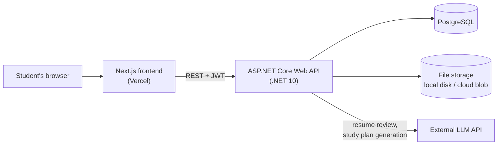

# PursuitHQ — Architecture

## 1. System Overview



The frontend never talks to the database, file storage, or the AI provider directly. Everything goes through the API, which is the only place that holds credentials.

## 2. Backend Layers

Requests flow in one direction, and each layer has one job:

```
HTTP request
   ↓
Controller      validates input, reads the user id from the JWT, maps DTO ↔ entity
   ↓
Service         business logic, AI calls, file storage operations
   ↓
DbContext       Entity Framework Core queries
   ↓
PostgreSQL
```

**Rules**
- Controllers contain no business logic and no direct file/AI calls.
- Services never accept or return DTOs — they work with entities and domain types.
- Entities never leave the API; controllers always map to DTOs first.
- Every query is filtered by the authenticated user's id. No exceptions.

## 3. Project Structure

```
PursuitHQ.API
├── Controllers      AuthController, CoursesController, AssignmentsController,
│                    MaterialsController, NotesController, FoldersController,
│                    StudySessionsController, ApplicationsController,
│                    ResumesController, GoalsController, SkillsController,
│                    CertificationsController, NetworkController,
│                    MessagesController, DashboardController
├── Models           Entity classes (see DatabaseDesign.md)
├── DTOs             Request/response shapes, one folder per feature
├── Services         IFileStorageService, LocalFileStorageService,
│                    ResumeAiService, StudyPlannerAiService
├── Data             ApplicationDbContext, seed data
├── Migrations       EF Core migrations (generated)
├── Program.cs       Service registration and middleware pipeline
└── appsettings.json Non-secret configuration
```

## 4. File Storage Design

Uploaded study materials are **not** stored in PostgreSQL. The database stores metadata; the bytes go to storage behind an interface:

```csharp
public interface IFileStorageService
{
    Task<string> SaveAsync(Stream content, string contentType);   // returns StoredPath
    Task<Stream> OpenAsync(string storedPath);
    Task DeleteAsync(string storedPath);
}
```

- **Development:** `LocalFileStorageService` writes to a configured folder outside `wwwroot` (so files are never served statically — every download goes through an authorized endpoint).
- **Production:** swap in an Azure Blob or S3 implementation. Nothing else changes: no entity, controller, or migration is affected.

**Upload pipeline**
1. Check `Content-Length` against the configured max (reject with 413 before reading the body).
2. Validate the content type against the allow-list (reject with 415).
3. Generate a GUID-based `StoredPath` — never trust or reuse the client's file name on disk.
4. Write the file, then insert the `StudyMaterial` row. If the DB insert fails, delete the orphaned file.
5. On delete, remove the DB row first, then the file. Log and retry orphaned files rather than failing the request.

**Download pipeline**
Every download hits an authorized endpoint that loads the record, confirms the caller owns it, then streams from storage with the original `FileName` as the download name.

## 5. AI Service Design

Both AI features follow the same shape, so they share one pattern:

```
Controller  →  *AiService  →  build prompt from the user's own data
                           →  call LLM API (key from configuration, never client-side)
                           →  parse structured response
                           →  return suggestions (nothing persisted yet)
Controller  →  returns suggestions to the client for review
Client      →  user accepts  →  separate endpoint persists the accepted items
```

**`ResumeAiService`** — input: one resume's content. Output: section-level suggestions with the original text, the proposed text, and a reason. Stored resume is untouched until the user accepts.

**`StudyPlannerAiService`** — input: courses, upcoming assignment due dates, existing sessions, and a date range. Output: suggested study sessions. Saved with `IsAiGenerated = true` only on acceptance.

**Shared rules**
- API keys live in configuration/secrets, never in the frontend or in source control.
- Every AI endpoint is rate-limited per user (see Security.md) to bound spend.
- Every AI call has a timeout; on failure the endpoint returns a readable error and changes nothing.
- Prompts include only the requesting user's own data.

## 6. Frontend Route Map

| Route | Purpose |
|---|---|
| `/login`, `/register`, `/forgot-password` | Auth (public) |
| `/dashboard` | Post-login home |
| `/calendar` | Week/month view of classes, assignments, study sessions |
| `/courses` | Course list |
| `/courses/[id]` | Course detail: schedule, assignments |
| `/courses/[id]/materials` | Folder tree, file upload, notes |
| `/courses/[id]/notes/[noteId]` | Note editor |
| `/assignments` | All assignments across courses |
| `/study-planner` | Study sessions + AI generation |
| `/applications` | Job/internship board and table views |
| `/resumes`, `/resumes/[id]` | Resume list and editor with AI review |
| `/growth` | Goals, skills, certifications |
| `/network`, `/network/messages` | Students, connections, messaging |
| `/settings` | Profile, password, account deletion |

Protected routes check for a valid token and redirect to `/login` when missing.

## 7. Configuration

Non-secret values live in `appsettings.json`; secrets come from user-secrets in development and environment variables in production (see Deployment.md).

| Key | Purpose |
|---|---|
| `ConnectionStrings:DefaultConnection` | PostgreSQL connection string |
| `Jwt:Issuer`, `Jwt:Audience`, `Jwt:Key` | Token signing and validation |
| `Jwt:ExpiryMinutes` | Access token lifetime |
| `FileStorage:Provider` | `Local` or `Cloud` |
| `FileStorage:LocalPath` | Folder for local storage |
| `FileStorage:MaxFileSizeBytes` | Per-file upload cap |
| `FileStorage:AllowedContentTypes` | Upload allow-list |
| `Ai:Provider`, `Ai:ApiKey`, `Ai:Model` | LLM configuration |
| `Ai:RequestsPerUserPerDay` | Rate limit for AI endpoints |
| `Cors:AllowedOrigins` | Frontend origins permitted to call the API |
