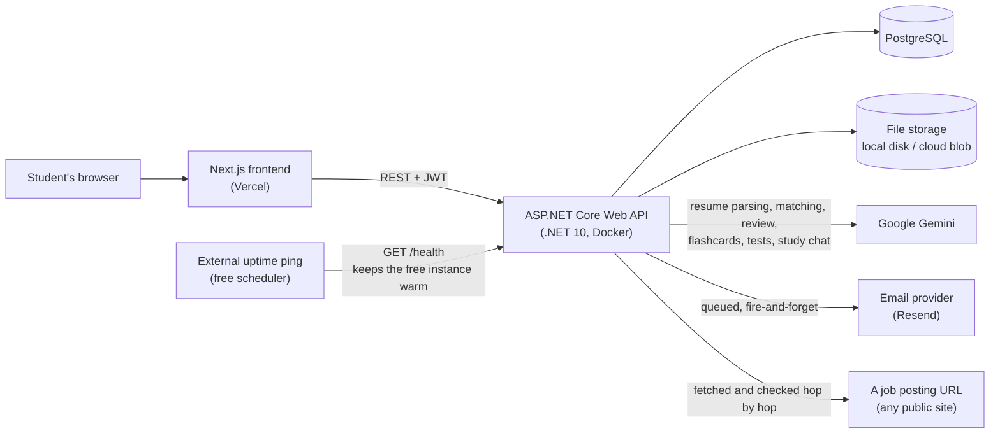

# PursuitHQ — Architecture

## 1. System Overview



The frontend never talks to the database, file storage, or the AI provider directly. Everything goes through the API, which is the only place that holds credentials.

There is no external cron and no job-board integration. Reminders run on a timer inside the API (§7b), and the only thing an outside scheduler is asked to do is keep the free instance awake by hitting `/health`.

## 2. Backend Layers

Requests flow in one direction, and each layer has one job:

```
HTTP request
   ↓
Controller      validates input, reads the user id from the JWT, maps DTO ↔ entity
   ↓
Service         business logic, AI calls, file storage operations
   ↓
DbContext       Entity Framework Core queries
   ↓
PostgreSQL
```

**Rules**
- Controllers contain no business logic and no direct file/AI calls.
- Services never accept or return DTOs — they work with entities and domain types. `StudentCardMapper` is the deliberate exception: it exists precisely so that "who is allowed to see the email address" is decided in exactly one place.
- Entities never leave the API; controllers always map to DTOs first.
- Every query is filtered by the authenticated user's id. No exceptions.
- `ApiControllerBase` carries `[Authorize]` and exposes `CurrentUserId` from the token, so a controller has to *opt out* of authentication with `[AllowAnonymous]` rather than remember to opt in. Forgetting to secure an endpoint is a far more common mistake than accidentally securing one.

A service used by one or two actions on a large controller is injected per action with `[FromServices]` rather than through the constructor — the notifiers and the photo service on `ConversationsController` are the cases. It keeps a constructor with three dependencies from growing to eight for the sake of two endpoints.

## 3. Project Structure

```
PursuitHQ.API
├── Controllers      ApiControllerBase, AuthController, CoursesController,
│                    ClassSchedulesController, AssignmentsController,
│                    MaterialsController, NotesController, FoldersController,
│                    CalendarController, CalendarEventsController,
│                    RemindersController, DashboardController,
│                    FlashcardDecksController, QuizzesController,
│                    StudyController, ResumesController, SavedJobsController,
│                    StudentsController, ProfilePhotoController,
│                    ConnectionsController, ConversationsController,
│                    NotificationsController, PreferencesController
├── Models           Entity classes (see DatabaseDesign.md)
├── DTOs             Request/response shapes, one folder per feature
├── Services         IFileStorageService, LocalFileStorageService,
│                    IProfilePhotoService, ProfilePhotoService,
│                    ITextExtractionService, TextExtractionService,
│                    IAiService, GeminiAiService, IAiUsageLimiter, AiUsageLimiter,
│                    IResumeAiService, ResumeAiService, ResumeFormatChecker,
│                    IJobDescriptionFetcher, JobDescriptionFetcher,
│                    IStudyToolAiService, StudyToolAiService,
│                    IStudyChatService, StudyChatService,
│                    ICalendarFeedService, CalendarFeedService,
│                    IConnectionService, ConnectionService, StudentCardMapper,
│                    IUserClock, UserClock, ITokenService, TokenService,
│                    IEmailService, ResendEmailService, ConsoleEmailService,
│                    EmailLayout, IEmailQueue, EmailQueue, EmailQueueWorker,
│                    ICreationNotifier, IMessageNotifier, IRequestNotifier,
│                    INotificationService, NotificationService,
│                    ReminderBackgroundService, DatabaseHealthCheck
├── Data             ApplicationDbContext
├── Migrations       EF Core migrations (generated)
├── Dockerfile       Container build for deployment (§10)
├── Program.cs       Service registration and middleware pipeline
└── appsettings.json Non-secret configuration
```

**What is not here, and why**

- There is **no internship tracker and no job search**. Both were removed in September 2026. No controller, service, or page remains. The `JobApplication` table is still in the model and still has its index, unused, so the feature could return without a migration. Do not read it as a live feature.
- There is **no `JobSearchService`** and **no `StudyPlannerAiService`**. Older documents name both; neither has a class. AI-generated study plans were never built, and `StudySession` is an unused table that `CalendarFeedService` stopped reading in September 2026 for the same reason — nothing ever created one.
- `SavedJob` is *not* job search. It is a posting the student pasted or linked while matching a resume against it, kept with the score it got (§6d).

## 4. Time: Wall Clock, Not Instants

This is the single most load-bearing decision in the system, and everything with a date in it depends on getting it right.

**A stored `DateTime` in PursuitHQ is a wall-clock time, not an instant.** A 9am class is 9am. A paper due at 11:59pm is due at 11:59pm. Neither means anything on a universal timeline, and converting either one to UTC and back is how a due date lands on the wrong day.

Two pieces enforce it.

### The value converter

Every `DateTime` column is PostgreSQL `timestamp with time zone`, and Npgsql refuses to write a `DateTime` whose `Kind` is `Unspecified` to one. `Unspecified` is exactly what the app produces everywhere that matters: a `datetime-local` input sends `2026-09-08T09:00` with no offset, and `DateOnly.ToDateTime()` is `Unspecified` too. So `ApplicationDbContext.ConfigureConventions` registers a converter on every `DateTime` property (which covers `DateTime?` — EF wraps it for nulls itself):

```
going in     Utc         → unchanged
             Local       → converted to UTC, because it really does carry an offset
             Unspecified → Kind stamped as Utc so the driver accepts it, value untouched

coming out   always      → Kind stripped back to Unspecified
```

**Stripping it on the way out is the half that matters to the UI.** `System.Text.Json` writes a `Utc` `DateTime` with a trailing `Z`; the browser reads that as an instant and shifts it into local time, and an assignment due at 11:59pm shows up on the following day. `Unspecified` serializes with no suffix, which JavaScript parses as local time — the same wall clock that was stored.

### `IUserClock`

If a stored time is a wall clock, then every question of the form *"has this passed yet?"* has to be asked against the student's wall clock. `DateTime.Now` on a laptop in Central time happens to be the right answer, which is why this was easy to get away with in development. On a deployed server `DateTime.Now` is UTC, and an assignment due at 11:59pm Central would start showing as overdue at 6:59pm.

```csharp
public interface IUserClock
{
    DateTime LocalNow(string? timeZoneId);                     // zone already in hand
    Task<DateTime> LocalNowAsync(string userId, CancellationToken ct = default);
}
```

- Scoped, and it caches the zone per user for the life of the request. The dashboard asks more than once — overdue assignments, then overdue reminders — and the answer must not change halfway through.
- An unrecognised zone id logs a warning and falls back to server time rather than throwing. Windows and Linux disagree about zone names often enough that this will fire for real; a clock an hour off is a nuisance, a page that will not load is a real problem.
- `DashboardController`, `AssignmentsController`, `CalendarFeedService` and `NotificationService` all go through it. Nothing that compares against "now" should call `DateTime.Now` directly.

The container has to cooperate too — see the `tzdata` note in §10.

## 5. File Storage Design

Uploaded study materials are **not** stored in PostgreSQL. The database stores metadata; the bytes go to storage behind an interface:

```csharp
public interface IFileStorageService
{
    Task<string> SaveAsync(Stream content, string originalFileName, CancellationToken ct = default);
    Task<Stream> OpenAsync(string storedPath, CancellationToken ct = default);
    Task DeleteAsync(string storedPath, CancellationToken ct = default);
}
```

- **Now:** `LocalFileStorageService` writes under `ContentRootPath`, never `WebRootPath` — files must not sit in `wwwroot`, where the server would hand them to anyone who guessed the URL. Every download goes through an authorized endpoint instead.
- **Production:** swap in an Azure Blob, S3 or R2 implementation. Nothing else changes: no entity, controller, or migration is affected. This matters more than it sounds — Render's free disk is ephemeral (see Deployment.md).

**Upload pipeline**
1. Check the size against the configured cap before reading the body.
2. Validate against `FileStorageOptions.IsAllowed`. The **extension allow-list is the real gate**. A missing or `application/octet-stream` content type is accepted, because Windows reports plenty of ordinary coursework that way and refusing it rejected real `.pptx` and `.docx` files; a content type that actively contradicts the extension is still refused. The browser only repeats what the operating system told it, so that header was never a boundary.
3. Generate a GUID storage key — the client's file name is never used on disk, because it can contain path characters or collide with someone else's upload. Files are spread across a subfolder named from the first two characters of the key so no directory ends up with tens of thousands of entries.
4. The key stored in the database is relative, so moving the storage folder does not invalidate every row.

**Download pipeline**
Every download hits an authorized endpoint that loads the record, confirms the caller may have it, then streams from storage with the original display name — stripped of any path, since that name is only ever shown and never used to open anything.

### 5a. Images

Profile photos, group pictures and pictures shared in a chat do **not** go straight to storage. They go through `ProfilePhotoService`, which decodes them with ImageSharp and re-encodes them. Re-encoding is the whole point, and it does three jobs at once:

1. **It strips EXIF.** Phone photos routinely carry GPS coordinates. A profile picture is shown to people the student has never met, and a photo dropped into a group chat reaches everyone in the room. Decoding and re-encoding drops every metadata block.
2. **It proves the file is an image.** A file can carry a `.jpg` extension and an image content type and still be something else. If ImageSharp cannot decode it, it is not stored — and **only a file that came through here is ever marked `IsImage`**, which is the flag that decides whether an attachment may be rendered in an `` tag. A content type from an upload is a claim, not a fact.
3. **It bounds the size.** Avatars are cropped square at 512px; a shared picture keeps its shape and is capped at 1600px.

PNG in, PNG out — screenshots of code and slides are the most common thing a student shares, and JPEG turns small text into a smear. Everything else becomes JPEG at quality 82.

## 6. AI Service Design

Every AI feature goes through one interface, so the provider can be swapped without touching a feature:

```csharp
public interface IAiService
{
    bool IsConfigured { get; }
    Task<string> CompleteAsync(string prompt, string? model = null, CancellationToken ct = default);
    Task<GroundedResult> CompleteWithSearchAsync(string prompt, string? model = null, CancellationToken ct = default);
}
```

`CompleteWithSearchAsync` returns the text plus the citations the model actually used. Those carry real URLs from real search results, unlike any link a model writes into its own prose.

Feature services sit on top of it: `IAiService` knows how to reach Gemini, the feature service knows what to ask and what a usable answer looks like. Prompt wording and answer validation change far more often than the transport does.

| Service | Does |
|---|---|
| `IResumeAiService` | Parses an uploaded resume into sections, scores one against a job description, and reviews its content |
| `IStudyToolAiService` | Generates flashcards and practice tests, and grades written answers against the key |
| `IStudyChatService` | The course tutor: answers questions about the student's own material and produces guides and tests as saveable artifacts |

`ResumeFormatChecker` is deliberately **not** AI. Format problems — margins, length, missing contact details — are rules, and a rule gives the same answer twice.

**Shared rules**
- API keys live in configuration/secrets, never in the frontend or in source control.
- Every service exposes `IsConfigured`, so an unconfigured key produces a readable "this feature is not set up" rather than a failed call.
- Every AI call has a timeout (90s on the HTTP client, `Ai:TimeoutSeconds` for the work itself); on failure the endpoint returns a readable error and changes nothing.
- Always validate what comes back. A well-formed response can still contain a card with an empty answer or a test question whose stated correct answer is not among its options. Reject bad items before the student sees them.
- Prompts contain only the requesting student's own data.

### 6a. AI Provider — Google Gemini

**Decision:** Google Gemini via `IAiService`. Its Flash models have a genuinely free tier, which lets every AI feature be built and tested at no cost.

Gemini is a REST API, so a typed `HttpClient` is enough — no third-party SDK. The key travels in a header, never in the URL, because query-string keys leak into logs and browser history.

Model ids live in configuration (`Ai:SearchModel`, `Ai:StudyToolModel`, `Ai:ResumeModel`) rather than in code, so they can be changed without a redeploy. They change as Google ships new versions — verify against the current model list rather than trusting a value written down here.

**Privacy: the free tier trade-off**

**On Gemini's free tier, Google states that content is used to improve their products. On paid tiers it is not.**

PursuitHQ sends lecture notes, uploaded coursework and resumes to this API, so this is a real disclosure obligation, not a footnote:

- While the app is in development and you are the only user, this is a non-issue.
- **Before other people use the AI features**, the privacy policy must say plainly that material submitted to study tools and resume review is sent to Google and may be used to improve their models.
- Better: move to a paid tier before public signups. This is the main reason `IAiService` exists.

### 6b. Text Extraction

Before an uploaded file can become flashcards, a test, or an answer from the tutor, its text has to come out of it.

```csharp
public interface ITextExtractionService
{
    bool CanExtract(string fileName, string contentType);
    Task<TextExtractionResult> ExtractAsync(
        Stream file, string fileName, string contentType, int maxCharacters = 100_000,
        CancellationToken ct = default);
}

public record TextExtractionResult(string Text, bool Truncated, int SectionCount);
```

Covers PDF, DOCX, PPTX, XLSX, TXT and MD.

**Rules**
- Extraction happens on demand when the student asks for something, not at upload time — most uploads never become study tools, and extracting everything wastes work.
- `Truncated` comes back with the text rather than being decided inside, so the caller can tell the student that only part of the document was used.
- Scanned or image-only PDFs produce no text. `IsEmpty` exists so that is caught and explained, rather than sending an empty prompt to the model.
- Extracted text is not stored. It is regenerated when needed, so the file stays the single source of truth.

### 6c. Usage Limits

`IAiUsageLimiter` counts requests per student per day, in memory, expiring at midnight so "per day" means what the student thinks it means. Endpoints `Peek` before doing the work and `Consume` when they do it.

The read-modify-write is inside a lock, because `IMemoryCache` is not atomic and two requests arriving together would otherwise both read the same count and both write count + 1.

**This is a soft guard against runaway loops, not a billing control, and the code says so.** It is a singleton, so the counters die with the process, and if PursuitHQ ever runs on more than one instance each process would allow the full limit on its own. Moving it to the database or a shared cache is the fix, and it is not needed until there is a second instance.

### 6d. Reading a Job Posting from a URL

The resume matcher accepts a link instead of pasted text. Taking a URL from a user and asking the server to open it is the exact shape of a server-side request forgery, so `JobDescriptionFetcher` is built around that:

```
for each hop (max 5):
    resolve the host
    ├─ every address it answers with is checked
    └─ refuse loopback, 10/8, 172.16/12, 192.168/16, 169.254/16 (cloud metadata),
       0/8, multicast and reserved, and the IPv6 equivalents
    request it with AllowAutoRedirect = false
    if 301/302/303/307/308 → take Location, loop (and check it again)
    else → read at most 2MB, strip to text, return
```

**Why it is written this way**
- `AllowAutoRedirect` is turned off on the handler in `Program.cs` and redirects are followed by hand, so **every hop is checked**. A public URL that redirects to `localhost` is the usual way past a naive check that only validates what the user typed.
- The host is resolved and *every* returned address is checked, because a perfectly ordinary-looking name can point anywhere.
- The response is capped at 2MB while streaming, so a huge page cannot exhaust memory.
- Only `text/*` and HTML are accepted; anything else is refused with advice to upload the file.

It also fails honestly. Workday, Greenhouse, LinkedIn and Indeed build postings in the browser or block anything that is not one, so what comes back is a login wall or an empty shell. That is not fixable from here, which is why the API never throws from this path — it returns `Ok = false` with a message that says to paste the text instead, and pasting is always offered alongside.

## 7. Background Work and Email

Which `IEmailService` is registered depends on whether a key and a verified from-address both exist. With neither, `ConsoleEmailService` prints the mail. That is on purpose: the whole email pipeline can be built and tested before a domain is bought, and a misconfigured server prints emails rather than silently dropping them.

### 7a. The Email Queue

No email is sent from inside a request. Adding a course, sending a message and accepting an invitation all hand a rendered email to a queue and return:

```
request thread          EmailQueueWorker (BackgroundService)
   │                             │
   │ Enqueue(EmailMessage)       │ await foreach over the channel
   ├────────────────────────────►│ scope per message → IEmailService.SendAsync
   │ returns immediately         │ one failure logs and the loop carries on
   ▼                             ▼
 response
```

**Why this design**
- "Add course" must not sit waiting on an HTTP call to Resend, and a provider having a bad minute must not turn a successful save into a 500.
- The channel is **bounded at 500 and drops rather than blocks** when full. Unbounded would let a runaway loop eat memory until the process dies; blocking would stall the request that queued it. A dropped confirmation is a nuisance, a stalled request is a bug.
- A scope per message, because `IEmailService` may be a typed `HttpClient` and must not be held for the life of the application.
- One bad email must not end the loop — that would stop every later one, silently.

**The trade-off, stated plainly:** the queue is in memory, so anything still in it when the API stops is lost. That is acceptable for a *confirmation* — it is a courtesy, and the thing it confirms is already in the database. Reminders, which actually matter, do not go through here (§7b).

Three notifiers use the queue. All three swallow their own exceptions and log, because every one of them is called after the thing it describes is already saved.

| Notifier | Sends | Throttle |
|---|---|---|
| `ICreationNotifier` | "You added a course / assignment / event" | None; off unless the student opted in |
| `IMessageNotifier` | "X sent you a message" | One per conversation per person per 15 min, and skipped entirely for anyone whose last read was under 90 seconds ago |
| `IRequestNotifier` | Connection requests and group invitations | None — a single event that needs an answer, and the API already refuses a second pending request |

Two details worth keeping:

- **Preferences are queried the other way round: who has switched this *off*.** A student who has never opened the settings page has no preference row at all, so looking for rows that say yes would quietly leave every one of them out of email that is meant to be on by default. (`ICreationNotifier` is the exception, because creation confirmations are opt-in.)
- **The emails name who it is from and nothing more.** No message text, no connection note. Putting the text in would hand what two students said to each other to a mail provider, leave it in an inbox that may be read over somebody's shoulder, and make "delete for everyone" a lie.

### 7b. Reminders

Reminders are the one piece of email that is a record rather than a courtesy, so they are built the opposite way: written down, deduplicated, and never dropped.

```
ReminderBackgroundService (BackgroundService)
        │  every 5 minutes, after a 30s startup delay
        │  scope per run
        ▼
INotificationService.RunAsync()
        ├─ every student with EmailEnabled, joined to their zone
        ├─ localNow = IUserClock.LocalNow(their zone)   ← §4
        ├─ assignment reminders   (6h grace)
        ├─ event reminders        (20m grace)
        ├─ a morning summary
        ├─ a Sunday look at the week
        ├─ skip anything already in Notification (no duplicates)
        └─ write a Notification row per send (Sent or Failed)
```

**Why in-process rather than an external cron**

The previous design had a free cron service POST to a secured `/api/jobs/run`. That endpoint does not exist and `JobsController` was never built. The timer runs inside the API instead, because this has to work on a laptop with no server in front of it.

**What that costs, and how it is handled:** reminders only go out while the API is up, and a laptop closes. That is what the grace periods are for — without them a missed run steps straight over the window and the reminder never goes at all. Six hours for assignments, twenty minutes for events, because "your 9am lecture is starting" delivered at 11 is just noise.

Moving to a secured endpoint plus a hosted cron later changes nothing in `NotificationService`, because none of the reminder logic lives in the timer.

**Rules**
- The run is idempotent: running it twice sends nothing twice, because `Notification` records what already went out.
- One student's bad data never aborts the run — each kind of reminder is isolated and failures are counted, not thrown.
- Every time comparison is against that student's wall clock, never the server's. Comparing wall-clock values against UTC is how people get emailed at 4am.

## 8. The Social Layer

Everything in §§4–7 concerns one student's own data, where a missing filter shows you an error. This section is different in kind: a missing check here shows you somebody else's conversation. Both halves are built so that the check cannot be forgotten.

### 8a. Connections and Profile Visibility

A `Connection` is **one row per pair**, with a requester, an addressee and a status (`Pending`, `Accepted`, `Declined`, `Blocked`). Direction matters while a request is pending — one person is waiting for an answer and the other owes one — and stops mattering once it is accepted. A unique index on `(RequesterId, AddresseeId)` keeps it to one row, because a second row for the same two people would make "are they connected" ambiguous.

Blocking is a status on that same row rather than a list of its own, so *"what is the state between these two people"* is always one lookup with one answer. Two places to check is how a blocked person ends up still able to message.

`IConnectionService` is the only thing that asks the question, and it asks it in both directions:

```csharp
public interface IConnectionService
{
    Task<Connection?> BetweenAsync(string a, string b, CancellationToken ct = default);
    Task<bool> AreConnectedAsync(string a, string b, CancellationToken ct = default);
    Task<bool> IsBlockedAsync(string a, string b, CancellationToken ct = default);
    Task<ProfileVisibility> VisibilityAsync(string viewerId, string subjectId, CancellationToken ct = default);
}
```

`VisibilityAsync` returns one of three answers, and everything that shows a person obeys it:

| Visibility | Reached when | Shows |
|---|---|---|
| `Full` | Looking at yourself, or connected | Card plus email, major, graduation year |
| `Card` | A pending or declined request exists, you are the blocker, or they opted into the directory | Name, photo, school, education level |
| `None` | You were blocked, or there is no relationship and they are not discoverable | Nothing — treated as 404 |

Three decisions inside it are worth stating:

- **Blocking is checked first and is asymmetric.** The blocked person gets exactly what a stranger gets — nothing — rather than an error that announces it. The blocker keeps the card, because otherwise there is nowhere left to undo it from.
- **A pending or declined request still leaves the card visible.** The request is itself proof the viewer reached this person legitimately, and a declined request making someone vanish mid-flow reads as a bug.
- **With no relationship at all, only a discoverable profile is visible.** Discoverability is off by default; nobody is enrolled in a directory by signing up for a planner. Without this rule, guessing an id would show a card for someone who opted out.

`StudentCardMapper.ToCard` is the one function that turns a user row into what another student may see. It **adds** the extra fields at `Full` rather than building the whole shape and blanking it — building-then-blanking is how a field gets missed. Every endpoint that returns a person uses it, because every leak of this kind starts with a second mapper written in a hurry somewhere else.

Finding people works two ways, with deliberately different rules:

- **Name search** (`GET /api/students/search`) lists only students who opted in, needs two characters, and returns at most 20.
- **Email lookup** (`GET /api/students/lookup`) is exact, never partial, and works whether or not the person is discoverable — that is the point, and it is how you find a classmate who would rather not be listed. The trade is that it confirms an address has an account, so it is capped at 20 per student per hour. A blocked viewer gets the same answer as a wrong address.

### 8b. Conversations

A `Conversation` is a direct chat or a group; the only differences are `IsGroup` and how membership is allowed to change. `ConversationMember` is one person's place in it, and it carries the whole lifecycle in one row:

```
Invited  ──accept──►  Active  ──leave/remove──►  Left
   │                                               │
   └──decline──► row removed                  rejoin clears LeftAt
```

Folding invitations into membership rather than giving them a table of their own keeps the unique index on `(ConversationId, UserId)` meaningful, so nobody can hold an invitation and a membership at once and end up in a group twice.

**The gate.** Every endpoint on `ConversationsController` starts by proving the caller is an *active* member, through one private helper. That helper returns null for a conversation that does not exist, one the caller was never in, one they have left, and one they have only been invited to — **all four become the same 404**, so the endpoint never reveals that a conversation exists to somebody outside it. Nothing reads or writes a message without going through it.

**Connections gate messaging.** Starting a direct chat with someone you are not connected to is a 403, as is inviting them to a group. That check is on the server, because the client is not what is being defended against — it is the rule that makes a connection request mean something.

Other decisions that are easy to undo by accident:

- `Conversation.LastMessageAt` is **denormalised on purpose**. It is the most-run query in the feature, and the alternative is a correlated `MAX(SentAt)` per conversation on every poll.
- Messages are **soft-deleted**: the row stays, the body is cleared, the UI says so. Removing it outright leaves a hole in a conversation two people are reading at once, and makes "did they say that?" unanswerable. Edits stamp `EditedAt`, because an edit that leaves no trace is a way to rewrite what somebody remembers being said.
- `Message.Sender` and `MessageReaction.User` cascade-delete is **`Restrict`, not `Cascade`**. Deleting an account must not silently erase that person's half of everyone else's group conversations. Attachments and reactions *do* cascade from their message, because they mean nothing without it.
- A group always has exactly one `Owner`, who cannot be removed and is the only one who can change roles. When an owner leaves, ownership passes to the longest-serving admin, or the longest-serving member if there are none. An ownerless group nobody can rename, add to or clean up is worse than any choice that rule makes.
- Membership changes are narrated as `System` messages in the timeline rather than derived, because they belong in the order they happened. Without them people appear and vanish from a group with no explanation.
- Muting and pinning are **per member**, not per conversation. Which conversations matter is one person's judgement, and pinning a group for everybody in it would be someone else deciding what you look at first.
- Attachments: at most 10 per message, 15MB each, and the whole upload capped at 60MB so Kestrel refuses it before it is read into the process. Images are re-encoded (§5a) and only then marked renderable; everything else is always served as a download, through the membership-checked endpoint.

### 8c. Real-Time: Polling, and What Replaces It

**There is no SignalR, no WebSocket and no server-sent events anywhere in PursuitHQ. Everything that looks live is the browser asking again.** This is the part of the architecture that drives both cost and scale, so it is worth being exact about.

```
                                   pauses when the tab is hidden
                                   ───────────────────────────────
open conversation   GET  /api/conversations/{id}/messages     every 5s
                    POST /api/conversations/{id}/read         with every one of those polls
                    GET  /api/conversations/{id}/presence     every 2.5s   (typing + read receipts)
                    POST /api/conversations/{id}/typing       at most every 2.5s, while typing

conversation list   GET  /api/conversations                   every 15s

unread dot          GET  /api/conversations/unread            every 30s   (lib/useUnread.js)
```

**Why these numbers**

- Presence is polled *faster* than messages because it is the part that has to feel immediate — a "typing" bubble that arrives five seconds late is worse than none — and because the response is two short lists whatever the history looks like. Pulling the whole message history every 2.5 seconds to learn one timestamp would be the wasteful version.
- The typing ping is throttled to 2.5s against a six-second server window, so a steady typist never flickers off and a fast one is not sending a request per keystroke. `POST /typing` is deliberately the cheapest write in the feature — one timestamp, no reads beyond the membership check — and it must never become more than that.
- Typing state is stored as a timestamp, not a flag, so it expires on its own. A boolean would stay true forever the moment somebody closed the tab mid-word.
- The message poll compares a signature of what came back and only re-renders when something changed, so the poll does not fight with the text box or reset the scroll position every five seconds.
- **Every one of these loops checks `document.visibilityState` and does nothing while the tab is hidden.** A laptop left open on the messages tab overnight would otherwise make thousands of pointless requests; `useUnread` also refreshes immediately on `visibilitychange`, so coming back to the tab is not up to 30 seconds stale.

**The known inefficiency.** `POST /read` fires on **every** message poll, whether or not a message arrived. An open conversation therefore writes a row and commits a transaction every five seconds for as long as it is on screen, even in a thread where nobody is saying anything. Guarding it on "did anything actually arrive, or was anything unread" is the obvious fix and has not been made.

**SignalR is the intended replacement, and `lib/useUnread.js` is the seam it plugs into.** Everything that displays a badge reads its count from that hook rather than polling on its own, so a push transport is a change to one file instead of every component that shows a dot. The message timer in `app/messages/page.js` is the other half; the rest of the page does not care where a new message came from.

Until then, every one of these intervals is a per-open-tab cost on a free instance, and the presence poll is the expensive one.

### 8d. Cost of the Social Layer at the Database

The indexes exist for exactly the queries the polls run, and they are worth keeping in mind before adding another loop:

- `ConversationMember (UserId, LeftAt)` and `(UserId, Status)` — the conversation list and the unread poll.
- `Message (ConversationId, Id)` — messages are paged newest-first by id, 50 at a time.
- `Connection (AddresseeId, Status)` — the incoming-requests list and the unread dot.
- `MessageReaction (MessageId, UserId, Emoji)` unique — what makes the reaction toggle safe: a double click cannot leave two behind.

## 9. Frontend Route Map

Next.js App Router, JavaScript, Tailwind. `AuthProvider` wraps every page: with no token it redirects to `/login`, and with one it confirms the token against `GET /api/auth/me` before trusting the cached profile.

| Route | Purpose |
|---|---|
| `/login`, `/register`, `/forgot-password`, `/reset-password` | Auth (the only public routes) |
| `/` | Redirects to `/dashboard` or `/login` |
| `/dashboard` | Post-login home: what is due, what is on today |
| `/calendar` | Week/month view of classes, assignments, events and reminders |
| `/courses` | Course list, with links into each course's material |
| `/courses/[id]/materials` | Folder tree, file upload, notes |
| `/courses/[id]/flashcards` | Generate and review decks for one course |
| `/courses/[id]/tests` | Generate practice tests for one course |
| `/courses/[id]/guides` | Study guides saved for one course |
| `/courses/[id]/sessions` | Past tutor conversations for one course |
| `/decks/[deckId]` | Flashcard review mode |
| `/tests/[quizId]` | Take a test; past attempts and scores |
| `/study` | The tutor: ask about your own material, save what it produces |
| `/assignments` | All assignments across courses |
| `/resume`, `/resume/[id]` | Resume list and editor with AI review |
| `/resume/jobs` | Postings kept from the matcher, with the score each resume got |
| `/students`, `/students/[id]` | Find students, requests, connections, and a profile |
| `/messages` | Direct and group chats |
| `/settings` | Profile, photo, password, two-factor, notification preferences, time zone, theme, account deletion |

`lib/api.js` is the only place the site calls the API. Every page goes through those helpers, so token handling and error handling live in one file. The base URL comes from `NEXT_PUBLIC_API_URL`, defaulting to `http://localhost:5051`.

**A known weakness, recorded here because it is architectural:** the token is kept in `localStorage`, which any script on the page can read. It should move to an `httpOnly` cookie before PursuitHQ opens to other people. See Security.md.

## 10. Deployment Plumbing

The API ships as a container. `Dockerfile` sits in the API folder and is built with that folder as its context: the project file is copied and restored first so a source change does not throw away restored packages, then `dotnet publish -c Release`.

**The runtime image is Debian with `tzdata` installed explicitly, and that is not an optimisation to undo.** PursuitHQ converts wall-clock times with IANA zone ids (§4), which needs both ICU and the zone database. Alpine ships without ICU, and `InvariantGlobalization` would drop the zone data entirely — either one turns every reminder, due date and class time into the wrong hour, silently, with nothing in the logs. The container listens on plain HTTP on 8080, because the host terminates TLS at its edge.

Four things in the pipeline exist for that arrangement:

```
UseForwardedHeaders        ← first, before anything reads the scheme or client address
  ↓
Development? UseSwagger / UseSwaggerUI
Production?  UseExceptionHandler("/error") + UseHsts
  ↓
UseHttpsRedirection
  ↓
UseCors("Frontend")
  ↓
UseAuthentication → UseAuthorization → MapControllers
```

- **Forwarded headers, first.** A host like Render terminates TLS at its edge and forwards plain HTTP to the container. Without this the app believes every request arrived over HTTP, `UseHttpsRedirection` redirects it, the edge forwards the retry as HTTP again, and the browser gives up on a redirect loop. `KnownNetworks` and `KnownProxies` are cleared because they default to loopback only, which would ignore the proxy's headers entirely — safe here because the only route in is the host's own proxy.
- **CORS from configuration.** `Cors:AllowedOrigins` is read as either one comma-separated value (`Cors__AllowedOrigins="https://a.com,https://www.a.com"`) or indexed keys (`Cors__AllowedOrigins__0`), because hosting panels differ about which they support. With nothing configured it falls back to `http://localhost:3000`. A deployed frontend can be allowed without a code change.
- **A production exception handler.** An unhandled exception becomes the same `ApiErrorDto` shape as every other failure, and never a stack trace. HSTS is on in production only.
- **Two health endpoints, on purpose.**

| Endpoint | Checks | For |
|---|---|---|
| `/health` | Nothing at all | The keep-warm ping |
| `/health/ready` | `DatabaseHealthCheck` — one `CanConnectAsync` | When you actually want to know |

  The split matters on the free plan. A ping that queried the database would keep the *database* awake too, and on a plan that bills by compute-hour and sleeps when idle, that ping alone would spend the monthly allowance on proving the app is alive.

## 11. Configuration

Non-secret values live in `appsettings.json`; secrets come from user-secrets in development and environment variables in production (see Deployment.md). Anything nested is set with `__` in an environment variable: `Cors__AllowedOrigins`, `Email__ApiKey`.

| Key | Purpose |
|---|---|
| `ConnectionStrings:DefaultConnection` | PostgreSQL connection string |
| `Jwt:Key` | Token signing key. **The app refuses to start without it**, with the user-secrets command in the message |
| `Jwt:Issuer`, `Jwt:Audience` | Token validation. Default to `PursuitHQ` / `PursuitHQClient` |
| `Jwt:ExpiryMinutes` | Access token lifetime (480 in `appsettings.json`; the code falls back to 60 if unset or unparseable) |
| `FileStorage:LocalPath` | Folder for local storage, relative to the content root |
| `FileStorage:MaxFileSizeBytes` | Per-file upload cap |
| `FileStorage:MaxUserQuotaBytes` | Total storage per student |
| `FileStorage:AllowedExtensions` | Upload allow-list — the real gate |
| `FileStorage:AllowedContentTypes` | Secondary check; a type that contradicts the extension is refused |
| `Ai:ApiKey` | Gemini API key — server-side only, never in frontend code |
| `Ai:SearchModel`, `Ai:StudyToolModel`, `Ai:ResumeModel` | Model id per task, so models can be tuned without a redeploy |
| `Ai:TimeoutSeconds` | Per-request timeout |
| `Ai:RequestsPerUserPerDay` | Per-student daily cap on AI endpoints |
| `Email:ApiKey`, `Email:FromAddress` | Resend credentials. With either missing, `ConsoleEmailService` prints emails instead |
| `Email:FromName`, `Email:TimeoutSeconds` | Sender name and provider timeout |
| `Email:AppUrl` | Where the app lives, for links in emails. A reminder with no way back to the thing it is reminding you about is half an email |
| `Cors:AllowedOrigins` | Frontend origins permitted to call the API |
| `NEXT_PUBLIC_API_URL` | *(frontend)* Base URL of the API |

There is no `Jobs:SchedulerSecret` and no `JobSearch:*` section. Both belonged to features that no longer exist; if an environment still sets them, they are read by nothing.
