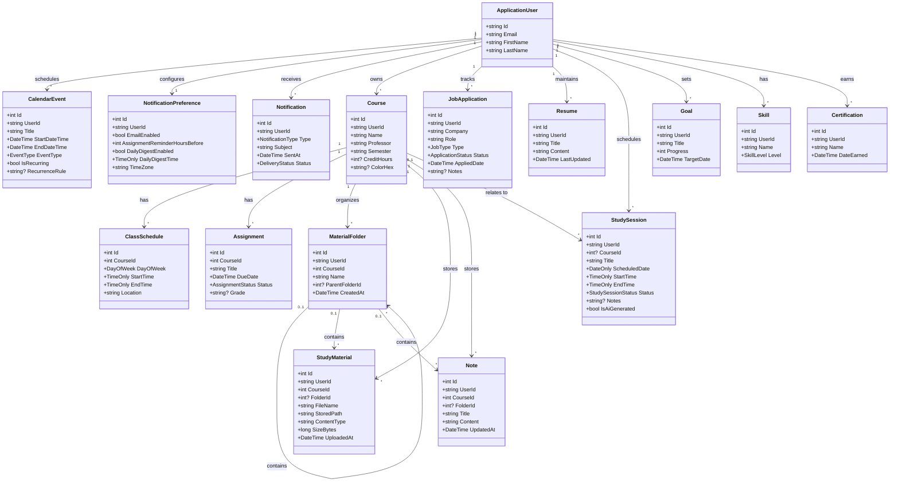
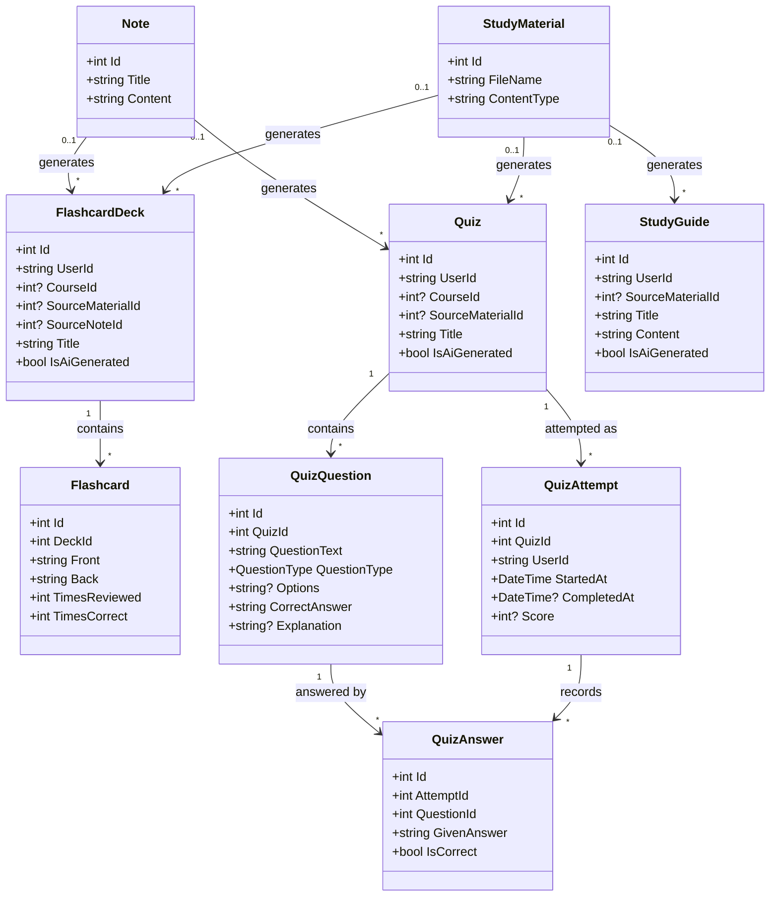
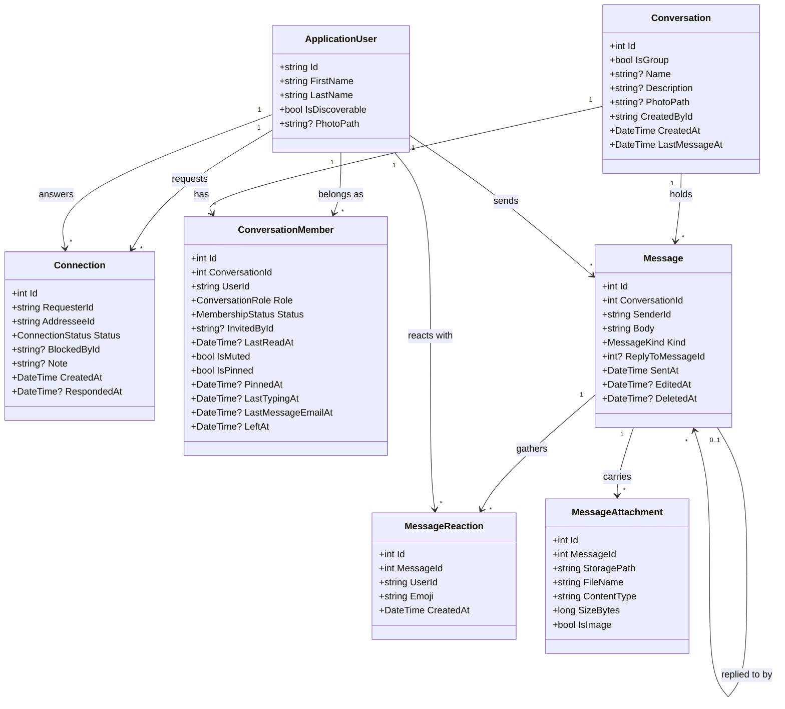

# PursuitHQ — Technical & Database Design

This document describes every class (entity) in PursuitHQ's backend, how they relate to each other, and the supporting layers (DTOs, Services, Data) that sit around them. It reflects the current planned feature set: authentication, academic planning, per-course study materials (files, folders, and typed notes), AI study tools (flashcards, quizzes, study guides), email reminders, internship/job search and tracking, an AI-assisted resume builder, an AI-assisted study planner, career growth tracking, and the social side of the app: student connections, direct chats, and group chats.

## 1. Entity Descriptions

### ApplicationUser *(extends ASP.NET Core Identity's `IdentityUser`)*

> **`SavedColors`** is a comma-separated list of hex values — the palette the
> student has built up, offered in both the event dialog and the course form.
> A joined string rather than a table of its own: it is short, ordered, always
> read and written whole, and never queried against.


The central identity for every student account. Authentication (registration, login, password hashing) is handled by ASP.NET Core Identity itself — this class only adds the extra fields PursuitHQ needs.

| Property | Type | Notes |
|---|---|---|
| Id | string (GUID) | Provided by Identity |
| Email | string | Provided by Identity |
| PasswordHash | string | Provided by Identity, managed automatically |
| FirstName | string | Custom addition |
| LastName | string | Custom addition |
| Major | string? | |
| School | string? | Max length 200 |
| GraduationYear | int? | |
| EducationLevel | enum (`EducationLevel`: NotSet, HighSchool, College, University, Other) | Stored as its int, so the numbers are part of the data — append, never renumber |
| IsDiscoverable | bool | Whether this student turns up when another one searches. **False by default** — being findable by strangers is not something to be enrolled in by signing up for a planner |
| PhotoPath | string? | Storage key for the profile photo, never sent to a client; the photo is served through an endpoint that checks who is asking, not from a public folder |
| PhotoContentType | string? | |
| TimeZone | string | IANA id, default `America/New_York`. See Section 4a — this is what "has it passed yet" is asked against |
| SavedColors | string? | Comma-separated hex values, max length 500 |
| CreatedAt | DateTime | |

Every other entity below that belongs to a specific student has a `UserId` (string) foreign key pointing at `ApplicationUser.Id`.

### Course

> Carries **`StartDate`** and **`EndDate`** (both optional): the first and last
> day the course meets. Class times repeat weekly, so without an end date a
> Tuesday class would draw itself on every Tuesday the calendar can reach.


| Property | Type | Notes |
|---|---|---|
| Id | int | |
| UserId | string | FK → ApplicationUser |
| Name | string | |
| Professor | string | |
| Semester | string | e.g. "Fall 2026" |
| StartDate | DateOnly? | First day the course meets |
| EndDate | DateOnly? | Last day it meets; bounds the weekly expansion on the calendar |
| CreditHours | int? | Optional |
| ColorHex | string? | Optional, used to color-code the calendar |
| CreatedAt | DateTime | |

### ClassSchedule

Represents one recurring weekly meeting time for a course. A single `Course` can have multiple `ClassSchedule` rows (e.g. a class that meets Monday and Wednesday at different rooms).

| Property | Type | Notes |
|---|---|---|
| Id | int | |
| CourseId | int | FK → Course |
| DayOfWeek | enum (`DayOfWeek`) | |
| StartTime | TimeOnly | |
| EndTime | TimeOnly | |
| Location | string | |

### CalendarEvent

Anything on a student's calendar that is not a class meeting, an assignment due date, or a study session: work shifts, club meetings, appointments, personal events.

| Property | Type | Notes |
|---|---|---|
| Id | int | |
| UserId | string | FK -> ApplicationUser |
| Title | string | |
| Description | string? | |
| StartDateTime | DateTime | |
| EndDateTime | DateTime | |
| IsAllDay | bool | True for events with no meaningful time of day, such as "Spring break". The times are still stored — midnight to 23:59:59 on the last day — so range queries need no special case |
| Location | string? | |
| EventType | enum (`EventType`: Work, Club, Appointment, Personal, Other) | |
| IsRecurring | bool | |
| RecurrenceRule | string? | iCal RRULE string, e.g. `FREQ=WEEKLY;BYDAY=TU,TH` |
| ColorHex | string? | |
| CreatedAt | DateTime | |

The calendar view is the union of four sources: `ClassSchedule` (recurring class times), `Assignment` (due dates), `StudySession` (planned study blocks), and `CalendarEvent` (everything else).

### Assignment

| Property | Type | Notes |
|---|---|---|
| Id | int | |
| CourseId | int | FK → Course |
| Title | string | |
| Description | string? | |
| DueDate | DateTime | Indexed |
| Status | enum (`AssignmentStatus`: NotStarted, InProgress, Completed) | |
| Grade | string? | Free text on purpose, e.g. "94" or "A-"; filled in after grading |
| CreatedAt | DateTime | |

### MaterialFolder

A folder inside a course, used to organize study materials like a file system. Folders can nest via `ParentFolderId` (null means it sits at the course root).

| Property | Type | Notes |
|---|---|---|
| Id | int | |
| UserId | string | FK -> ApplicationUser |
| CourseId | int | FK -> Course |
| Name | string | |
| ParentFolderId | int? | Self-referencing FK -> MaterialFolder; null = course root |
| CreatedAt | DateTime | |

### StudyMaterial

Metadata for one uploaded file. The file bytes live in storage (local disk in development, cloud object storage in production); only the metadata lives in PostgreSQL.

| Property | Type | Notes |
|---|---|---|
| Id | int | |
| UserId | string | FK -> ApplicationUser |
| CourseId | int | FK -> Course |
| FolderId | int? | FK -> MaterialFolder; null = course root |
| FileName | string | Original name shown to the user and used on download |
| StoredPath | string | Internal storage key (a GUID-based name), never exposed to the client |
| ContentType | string | MIME type, validated against the allow-list |
| SizeBytes | long | |
| Description | string? | Optional |
| UploadedAt | DateTime | |

### Note

A note typed directly in the app, stored as text rather than an uploaded file.

| Property | Type | Notes |
|---|---|---|
| Id | int | |
| UserId | string | FK -> ApplicationUser |
| CourseId | int | FK -> Course |
| FolderId | int? | FK -> MaterialFolder; null = course root |
| Title | string | |
| Content | string | Markdown or plain text |
| CreatedAt | DateTime | |
| UpdatedAt | DateTime | |

### NotificationPreference

One row per student controlling whether and when reminders are emailed. Created with defaults at registration.

| Property | Type | Notes |
|---|---|---|
| Id | int | |
| UserId | string | FK -> ApplicationUser, unique |
| EmailEnabled | bool | Master switch. When false, nothing is ever emailed |
| AssignmentRemindersEnabled | bool | |
| AssignmentReminderHours | string | `character varying(60)`. Comma-separated hours before the due date, largest first — `"168,24"` is a week ahead, and again the day before |
| EventRemindersEnabled | bool | Reminders for calendar events and classes |
| EventReminderMinutesBefore | int | e.g. 30 minutes before |
| DailyDigestEnabled | bool | A single morning summary email |
| DailyDigestTime | TimeOnly | Local time to send the digest, e.g. 07:00 |
| WeeklyDigestEnabled | bool | Week-ahead summary |
| WeeklyDigestDay | enum (`DayOfWeek`) | Which day it goes out; Sunday by default, but Monday suits people who would rather not think about the week until it starts |
| WeeklyDigestTime | TimeOnly | Local time to send it, e.g. 18:00 |
| CreationConfirmationsEnabled | bool | Email a confirmation when a course, assignment or event is added. **Off by default** — it is the only mail here not tied to a deadline, and one per record adds up fast |
| MessageEmailsEnabled | bool | Email when somebody messages you. **On by default.** The email names the sender and the group, never the message itself — a mail provider is a third party, and what two students said to each other is not its business |
| RequestEmailsEnabled | bool | Email when another student asks to connect, or invites you to a group. **On by default** — an invitation nobody sees is an invitation nobody accepts |
| TimeZone | string | IANA id, e.g. `America/New_York` — required so reminders arrive at the right local time |

*The reminder-hours list is a string, not a table.* It is written whole, read
whole, and never queried across. Read it with `ReminderOffsets.Parse` rather than
splitting it at the call site: the bounds (1 to 336 hours), the cap (4 entries)
and the largest-first ordering all live in one place, and the scheduler walks the
list in that order to work out which reminder an assignment is currently due for.
Parsing is forgiving on purpose — a row written by an older version should cost
one student one odd setting, not throw and take down the reminder run for
everybody else.

### Notification

A record of every email actually sent. Prevents duplicate sends and gives the student a history.

| Property | Type | Notes |
|---|---|---|
| Id | int | |
| UserId | string | FK -> ApplicationUser |
| Type | enum (`NotificationType`: AssignmentDue, EventReminder, DailyDigest, WeeklyDigest) | |
| RelatedEntityType | string? | e.g. `Assignment` |
| RelatedEntityId | int? | Together with the above, prevents sending the same reminder twice |
| Subject | string | |
| SentAt | DateTime | |
| Status | enum (`DeliveryStatus`: Sent, Failed) | |
| ErrorMessage | string? | |

Note: the email body is not stored, only the subject — bodies can contain assignment titles and other private content, and storing them adds risk without adding value.

### Reminder

A one-off thing to do on a given day: "email advisor", "buy lab goggles".

Deliberately not a `CalendarEvent`. An event occupies a slot and has a start and
an end; a reminder is a line you tick off, with a day attached and no time.
Bolting a "this one is really a to-do" flag onto events would leave every query
about events checking whether it meant this one.

| Property | Type | Notes |
|---|---|---|
| Id | int | |
| UserId | string | FK -> ApplicationUser |
| Title | string | |
| Notes | string? | |
| Date | DateOnly | A reminder belongs to a day rather than a moment, which also sidesteps the wall-clock converter in Section 4a entirely |
| IsCompleted | bool | |
| CreatedAt | DateTime | |

Indexed on (`UserId`, `Date`).

### JobApplication *(covers both internships and full-time/part-time jobs)*

| Property | Type | Notes |
|---|---|---|
| Id | int | |
| UserId | string | FK → ApplicationUser |
| Company | string | |
| Role | string | |
| Type | enum (`JobType`: Internship, PartTime, FullTime) | |
| Status | enum (`ApplicationStatus`: Saved, Applied, Interview, Offer, Rejected) | |
| AppliedDate | DateTime? | Null while the row is only Saved |
| Notes | string? | |
| Source | enum (`ApplicationSource`: Manual, Search) | How the application entered the tracker |
| ExternalJobId | string? | Id from the job-search provider, if sourced from search |
| SourceUrl | string? | Direct link to the original posting, used by the "Apply" button |
| CreatedAt | DateTime | |

Indexed on (`UserId`, `Status`).

### Resume

One record per resume version a student maintains. Content is stored as a single structured field rather than many normalized tables, which keeps this simple now and makes it easy to hand the whole thing to an AI service for editing.

| Property | Type | Notes |
|---|---|---|
| Id | int | |
| UserId | string | FK → ApplicationUser |
| Title | string | e.g. "Software Engineering Resume" |
| Content | string (JSON or structured text) | Sections: experience, education, skills, projects, etc. |
| LastUpdated | DateTime | |
| CreatedAt | DateTime | |

### SavedJob

A job posting the student kept, with the score their resume got against it.

| Property | Type | Notes |
|---|---|---|
| Id | int | |
| UserId | string | FK -> ApplicationUser |
| Title | string | |
| Company | string? | |
| Url | string? | Where it came from, when a link was used rather than pasted text |
| PostingText | string | The posting itself, as it was read |
| Score | int | The percentage at the moment it was saved |
| MatchJson | string | The whole match — requirements, evidence, suggestions — as JSON |
| ResumeId | int? | FK -> Resume, `SetNull` |
| Notes | string? | |
| SavedAt | DateTime | |

Indexed on (`UserId`, `SavedAt`).

*The posting text is stored alongside the link on purpose.* Postings come down
within weeks of a role closing, and without the text there is no way to see what
a saved score was measuring, or to run it again after editing the resume. For the
same reason `ResumeId` is `SetNull` rather than `Cascade`: the score was real when
it was recorded, and losing a whole saved job because a resume was tidied up
would be the wrong trade.

### StudySession

| Property | Type | Notes |
|---|---|---|
| Id | int | |
| UserId | string | FK → ApplicationUser |
| CourseId | int? | Optional FK → Course |
| Title | string | |
| ScheduledDate | DateOnly | |
| StartTime | TimeOnly | |
| EndTime | TimeOnly | |
| Status | enum (`StudySessionStatus`: Planned, Completed, Skipped) | |
| Notes | string? | |
| IsAiGenerated | bool | True if created by the AI study planner rather than the student |
| CreatedAt | DateTime | |

Indexed on (`UserId`, `ScheduledDate`).

### FlashcardDeck / Flashcard

A deck of flashcards, generated by AI from an uploaded file or a note, or created by hand.

**FlashcardDeck**

| Property | Type | Notes |
|---|---|---|
| Id | int | |
| UserId | string | FK -> ApplicationUser |
| CourseId | int? | FK -> Course |
| SourceMaterialId | int? | FK -> StudyMaterial, if generated from an upload |
| SourceNoteId | int? | FK -> Note, if generated from a typed note |
| Title | string | |
| IsAiGenerated | bool | |
| CreatedAt | DateTime | |

**Flashcard**

| Property | Type | Notes |
|---|---|---|
| Id | int | |
| DeckId | int | FK -> FlashcardDeck |
| Front | string | Question / term |
| Back | string | Answer / definition |
| Order | int | |
| TimesReviewed | int | |
| TimesCorrect | int | Supports "study the ones I keep missing" |

### Quiz / QuizQuestion / QuizAttempt / QuizAnswer

> `QuizAnswer` also carries **`Feedback`**, set only for written answers. Those
> are judged by AI rather than compared, and "wrong" with no reason is not much
> use when your words differed from the key but your meaning did not.


An AI-generated practice quiz and the student's attempts at it.

**Quiz**

| Property | Type | Notes |
|---|---|---|
| Id | int | |
| UserId | string | FK -> ApplicationUser |
| CourseId | int? | FK -> Course |
| SourceMaterialId | int? | FK -> StudyMaterial |
| SourceNoteId | int? | FK -> Note |
| Title | string | |
| IsAiGenerated | bool | |
| CreatedAt | DateTime | |

**QuizQuestion**

| Property | Type | Notes |
|---|---|---|
| Id | int | |
| QuizId | int | FK -> Quiz |
| QuestionText | string | |
| QuestionType | enum (`QuestionType`: MultipleChoice, TrueFalse, ShortAnswer) | |
| Options | string? | JSON array of choices, for multiple choice |
| CorrectAnswer | string | |
| Explanation | string? | Shown after answering |
| Order | int | |

**QuizAttempt**

| Property | Type | Notes |
|---|---|---|
| Id | int | |
| QuizId | int | FK -> Quiz |
| UserId | string | FK -> ApplicationUser |
| StartedAt | DateTime | |
| CompletedAt | DateTime? | |
| Score | int? | Percentage correct |

**QuizAnswer**

| Property | Type | Notes |
|---|---|---|
| Id | int | |
| AttemptId | int | FK -> QuizAttempt, `Cascade` |
| QuestionId | int | FK -> QuizQuestion, `Restrict` — deleting a question must not wipe historical attempt data |
| GivenAnswer | string | |
| IsCorrect | bool | |
| Feedback | string? | Set only for written answers, which are judged by AI rather than compared |

### StudyConversation / StudyMessage

The study chat, one conversation per course.

**StudyConversation** — `Id`, `UserId`, `CourseId`, `Title`,
`SourceMaterialIds`, `SourceNoteIds`, `CreatedAt`, `UpdatedAt`.

**StudyMessage** — `Id`, `ConversationId`, `Role` (User / Assistant), `Content`,
`ArtifactKind` (None / StudyGuide / PracticeTest), `ArtifactTitle`,
`ArtifactContent`, `SavedStudyGuideId`, `SavedQuizId`, `CreatedAt`.

Two decisions worth knowing:

*The chosen sources are a comma-separated string, not a join table.* The list is
always read and written whole, is never queried against, and belongs to exactly
one conversation. A `ConversationSource` table would be four files and a foreign
key to store what fits in a column. The same reasoning applies to
`ApplicationUser.SavedColors`.

*An artifact lives on the message until it is saved.* `ArtifactContent` holds the
guide or test the reply produced; only pressing Save writes a real `StudyGuide` or
`Quiz` row, and `SavedStudyGuideId` / `SavedQuizId` then link the two. That is why
the library never fills with half-formed attempts. Deleting a conversation
cascades to its messages but **not** to anything saved from them — those are
`SetNull`, because a saved guide outlives the chat that produced it.

### StudyGuide

A condensed, structured summary generated from one or more uploaded files (e.g. a set of lecture slides).

| Property | Type | Notes |
|---|---|---|
| Id | int | |
| UserId | string | FK -> ApplicationUser |
| CourseId | int? | FK -> Course |
| SourceMaterialId | int? | FK -> StudyMaterial |
| SourceNoteId | int? | FK -> Note |
| Title | string | |
| Content | string | Markdown |
| IsAiGenerated | bool | |
| CreatedAt | DateTime | |

### Goal

| Property | Type | Notes |
|---|---|---|
| Id | int | |
| UserId | string | FK → ApplicationUser |
| Title | string | |
| Description | string? | |
| Progress | int | 0–100 |
| TargetDate | DateTime? | Optional |
| IsCompleted | bool | |
| CreatedAt | DateTime | |

### Skill

| Property | Type | Notes |
|---|---|---|
| Id | int | |
| UserId | string | FK → ApplicationUser |
| Name | string | |
| Level | enum (`SkillLevel`: Beginner, Intermediate, Advanced) | |
| CreatedAt | DateTime | |

### Certification

| Property | Type | Notes |
|---|---|---|
| Id | int | |
| UserId | string | FK → ApplicationUser |
| Name | string | |
| Issuer | string? | |
| DateEarned | DateTime | |
| ExpiresOn | DateTime? | |
| CredentialUrl | string? | |
| CreatedAt | DateTime | |

### Connection

The relationship between two students. This row is what unlocks everything
social in the app: seeing a full profile, starting a chat, being added to a
group. Nothing checks "are they a student" and stops there — it checks this.

| Property | Type | Notes |
|---|---|---|
| Id | int | |
| RequesterId | string | FK -> ApplicationUser, `Cascade`. Who sent the request |
| AddresseeId | string | FK -> ApplicationUser, `Cascade`. Who has to answer it |
| Status | enum (`ConnectionStatus`: Pending, Accepted, Declined, Blocked) | |
| BlockedById | string? | Who pressed block, which is not always the requester — blocking is one-sided, so the blocked person should see nothing unusual while the blocker keeps the ability to undo it |
| Note | string? | A short line sent with the request — "we met in CS 201". The one piece of text a stranger can put in front of someone who has not accepted them, which is why it is the only one |
| CreatedAt | DateTime | |
| RespondedAt | DateTime? | |

Indexes: **unique** on (`RequesterId`, `AddresseeId`) — one row per pair,
whichever way round it was created, so "are they connected" is never ambiguous;
and (`AddresseeId`, `Status`), which drives the incoming-requests list and the
unread dot.

*Blocking is a status on the same row, not a list of its own.* "What is the
state between these two people" then has one lookup with one answer — two places
to check is how a blocked person ends up still able to message.

Direction matters while a request is pending and stops mattering once it is
accepted, so every lookup has to consider the pair in both orders.
`ConnectionService` is the only place that should be doing that.

### Conversation

A direct chat or a group chat. The only difference between the two is `IsGroup`
and how membership is allowed to change.

| Property | Type | Notes |
|---|---|---|
| Id | int | |
| IsGroup | bool | |
| Name | string? | Groups only — a direct chat is named after the other person |
| Description | string? | Groups only |
| PhotoPath | string? | Storage key for the group picture, never sent to a client |
| PhotoContentType | string? | |
| CreatedById | string | Who made it. Kept even after they hand ownership on or leave — it is history, not permission; the Owner role is what grants anything |
| CreatedAt | DateTime | |
| LastMessageAt | DateTime | Denormalised from `Message.SentAt` |

The group picture goes through the same pipeline as a profile photo, which
re-encodes it — so it cannot carry the GPS coordinates of wherever it was taken
into a room of people who were not there.

*`LastMessageAt` is duplicated on purpose.* The conversation list can then be
ordered and paged without touching `Messages`. It is the most-run query in the
feature — it runs on every poll for the unread dot — and the alternative is a
correlated `MAX(SentAt)` per conversation.

### ConversationMember

One person's place in one conversation. Every read and write of a message checks
for an `Active` row here. **That check is the whole security model for
messaging:** unlike the rest of PursuitHQ, where a missing filter shows you an
error, a missing membership check quietly shows you someone else's conversation.

| Property | Type | Notes |
|---|---|---|
| Id | int | |
| ConversationId | int | FK -> Conversation, `Cascade` |
| UserId | string | FK -> ApplicationUser, `Cascade` |
| Role | enum (`ConversationRole`: Member = 0, Admin = 1, Owner = 2) | Ordered so numeric comparison works |
| Status | enum (`MembershipStatus`: Invited, Active, Left) | One row through the whole lifecycle |
| InvitedById | string? | Who asked them in. Shown on the invitation |
| JoinedAt | DateTime | |
| LastReadAt | DateTime? | Everything after this is unread. Null means nothing read yet |
| IsMuted | bool | Stops this conversation counting toward the unread dot. Per member, not per conversation — muting a busy group must not quieten it for everybody else |
| IsPinned | bool | Keeps this conversation at the top of the list. Per member, like muting |
| PinnedAt | DateTime? | When it was pinned; null when it is not. Pinned chats are ordered by this, earliest first, so a new pin lands underneath the ones already there |
| LastTypingAt | DateTime? | Last time this person was seen typing here |
| LastMessageEmailAt | DateTime? | When this member was last emailed about a message here |
| LeftAt | DateTime? | When they left or were removed. `Status` is what the code checks; this is for showing "left on the 3rd" and for ordering rejoins |

Indexes: **unique** on (`ConversationId`, `UserId`); plus (`UserId`, `LeftAt`)
and (`UserId`, `Status`), both run on every poll of the conversation list.

*Invitations are folded into membership rather than given a table of their own.*
That is what keeps the unique index on (`ConversationId`, `UserId`) meaningful:
nobody can hold an invitation and a membership at the same time and end up in a
group twice. Rejoining a group clears `LeftAt` rather than adding a second row.

*`ConversationRole` is ordered so a numeric comparison works* — anything above
`Member` can invite and remove, and only `Owner` can change roles. There is
exactly one Owner per group and it cannot be removed by anybody, which is what
stops a group reaching a state where nothing can be administered. **The values
are stored, so they must never be renumbered.**

*`PinnedAt` orders pins instead of the last message.* Ordering pinned chats by
their latest message would let any of them jump over the others the moment
somebody typed, which makes a deliberately arranged list rearrange itself behind
your back.

*`LastTypingAt` is a timestamp rather than a flag* so it expires on its own. A
boolean would stay true forever the moment somebody closed the tab mid-word.

*`LastMessageEmailAt` is the whole email throttle.* A chat is a back-and-forth,
and without a record of the last one a five-minute conversation would put thirty
emails in somebody's inbox. It is stamped whenever a member qualified for an
email, sent or not, so the same rows are not re-examined on every message.

### Message

| Property | Type | Notes |
|---|---|---|
| Id | int | |
| ConversationId | int | FK -> Conversation, `Cascade` |
| SenderId | string | FK -> ApplicationUser, `Restrict` |
| Body | string | |
| Kind | enum (`MessageKind`: Text, System) | |
| ReplyToMessageId | int? | Self-referencing FK -> Message, `Restrict`. The message this one answers |
| SentAt | DateTime | |
| EditedAt | DateTime? | Set when the text has been changed since sending, and shown in the UI — an edit that leaves no trace is a way to rewrite what somebody remembers being said |
| DeletedAt | DateTime? | Soft delete: the row stays, the body is cleared, the UI says so |

Indexed on (`ConversationId`, `Id`) — messages are paged newest-first by id
within a conversation.

*`SenderId` is `Restrict`, not `Cascade`, deliberately.* Deleting an account must
not silently erase that person's half of everyone else's group conversations,
leaving the rest unreadable. `ReplyToMessageId` is `Restrict` for the same shape
of reason: deleting one message must not take every answer to it with it, and
messages are soft-deleted here anyway.

*System messages are stored, not derived.* "Sarah added Marcus", "Marcus left" —
they belong in the timeline in the order they happened. Without them people
appear and vanish from a group with no explanation, which reads as a bug.

### MessageReaction

One person's one emoji on one message.

| Property | Type | Notes |
|---|---|---|
| Id | int | |
| MessageId | int | FK -> Message, `Cascade` |
| UserId | string | FK -> ApplicationUser, `Restrict` |
| Emoji | string | The emoji itself, not a name |
| CreatedAt | DateTime | |

Indexed **unique** on (`MessageId`, `UserId`, `Emoji`).

*A row per person per emoji rather than a count*, because the interesting
question is not "how many thumbs up" but "did I already react, and who else
did" — and a count cannot answer either. The unique index is what makes the
toggle safe: double-clicking cannot leave two of the same reaction behind.

The emoji is stored rather than a name: a lot of emoji are several code points
once skin tones and joiners are involved, and storing a name would mean
maintaining a lookup table forever. `UserId` is `Restrict` for the same reason as
`Message.Sender` — deleting an account should not silently rewrite what everybody
else reacted to.

### MessageAttachment

A file or image sent with a message.

| Property | Type | Notes |
|---|---|---|
| Id | int | |
| MessageId | int | FK -> Message, `Cascade` |
| StoragePath | string | Storage key. Never sent to a client |
| FileName | string | What the sender called it, shown in the UI |
| ContentType | string | |
| SizeBytes | long | |
| IsImage | bool | Whether this is safe to render in an `img` tag |

*Its own table rather than columns on `Message`*, because one message can carry
several and because a message with no attachment — nearly all of them — should
not pay for six unused columns.

`FileName` is stored separately from `StoragePath` on purpose: the key is a GUID
so nothing about the file system can be guessed from a name, and the name is only
ever displayed, never used to open anything. `IsImage` is set only by the server,
and only for files it decoded and re-encoded itself — a content type from an
upload is a claim, not a fact, and rendering an attacker's claim inline is how a
chat becomes an XSS hole.

## 2. UML Class Diagrams

The model is split across three diagrams so each stays readable. Together they cover every entity in Section 1.

### 2.1 Core domain — accounts, academics, career




### 2.2 AI study tools



### 2.3 Students, connections, and messaging



## 3. DTO Pattern

Controllers should never accept or return the raw EF Core entities directly — that risks exposing internal fields (like `UserId`, which should always come from the authenticated user's token, never from client input) and makes it hard to change the database without breaking the API contract.

The pattern used throughout PursuitHQ: for each entity, define a matching pair of DTOs in the `DTOs` folder. Example for `Course`:

```csharp
// DTOs/CourseDto.cs — what the API returns
public class CourseDto
{
    public int Id { get; set; }
    public string Name { get; set; } = string.Empty;
    public string Professor { get; set; } = string.Empty;
    public string Semester { get; set; } = string.Empty;
}

// DTOs/CreateCourseDto.cs — what the client sends to create one
public class CreateCourseDto
{
    public string Name { get; set; } = string.Empty;
    public string Professor { get; set; } = string.Empty;
    public string Semester { get; set; } = string.Empty;
}
```

Notice `UserId` never appears in either DTO — the controller reads the current user's id from their authentication token and sets it on the entity itself.

## 4. Services Layer

| Service | Responsibility |
|---|---|
| Identity's `UserManager` / `SignInManager` | Registration, login, password management (built into ASP.NET Core Identity — no custom auth service needed) |
| `ResumeAiService` | Sends a student's `Resume.Content` to an AI API and returns suggested edits |
| `IFileStorageService` / `LocalFileStorageService` | Saves, streams, and deletes uploaded files; keeps storage details out of controllers so the backend can move to cloud storage later |
| `ITextExtractionService` | Pulls plain text out of uploaded PDF, DOCX, and PPTX files so it can be fed to the AI study tools |
| `StudyToolAiService` | Generates flashcards, quiz questions, and study guides from extracted text |
| `IEmailService` / `ResendEmailService` | Sends reminder and digest emails |
| `NotificationService` | Decides who is due a reminder, renders the email, records it in `Notification` |
| `IAiService` / `GeminiAiService` | The one AI client the study, resume and chat services go through, with `IAiUsageLimiter` in front of it |
| `IStudyChatService` / `StudyChatService` | Runs the per-course study chat and the artifacts its replies produce |
| `JobDescriptionFetcher` | Fetches a posting from a URL so it can be scored against a resume |
| `JobSearchService` *(planned)* | Queries an external job-board API and maps results into search hits |
| `StudyPlannerAiService` *(planned)* | Would read a student's `Course`, `Assignment`, and existing `StudySession` data and generate suggested `StudySession` rows (`IsAiGenerated = true`) |
| `ConnectionService` | The only place that looks a `Connection` up in both directions; everything social checks it before allowing a profile view, a chat, or a group invite |
| `ProfilePhotoService` | Decodes and re-encodes profile and group pictures, which is what strips EXIF (including GPS) from them |
| `MessageNotifier` | Decides who is owed a message email, honouring `MessageEmailsEnabled` and the `ConversationMember.LastMessageEmailAt` throttle |
| `RequestNotifier` | Emails connection requests and group invitations, honouring `RequestEmailsEnabled` |
| `CreationNotifier` | Sends the opt-in confirmation email when a course, assignment or event is created |
| `IUserClock` / `UserClock` | Wall-clock "now" for a given student, from `ApplicationUser.TimeZone`. See Section 4a |

Entries marked *(planned)* are described in the roadmap but have no class in
`Services` yet. Everything else exists.

## 4a. How DateTime values are stored

**Stored `DateTime` values are wall-clock times, not instants.** A 9am class is
9am; a paper due at 11:59pm is due at 11:59pm. Nothing is converted in either
direction.

Every `DateTime` column is PostgreSQL `timestamp with time zone`, and Npgsql
refuses to write a `DateTime` whose `Kind` is `Unspecified` — which is exactly
what a `datetime-local` input and `DateOnly.ToDateTime()` both produce. A value
converter in `ApplicationDbContext.ConfigureConventions` stamps the Kind going in
and strips it back to `Unspecified` coming out.

Stripping it on the way out is the half that matters to the UI: a `Utc` DateTime
serialises with a trailing `Z`, the browser reads that as an instant and shifts it
into local time, and an assignment due at 11:59pm lands on the wrong day.

**Do not introduce a UTC conversion on either side.** That was the cause of the
calendar returning 500 on every request, and separately of due dates landing a day
late.

**The gap this used to leave is now closed.** "Overdue" once compared against
`DateTime.Now`, the server's clock — correct while the app ran on one laptop,
wrong on a UTC host, where an assignment due at 11:59pm Central would start
showing as overdue at 6:59pm. `ApplicationUser.TimeZone` now exists, and every
"has this passed yet" question goes through `IUserClock`, which answers it
against that student's wall clock.

`Reminder.Date` and `StudySession.ScheduledDate` are `DateOnly` rather than
`DateTime` and so sidestep the converter entirely — there is no time of day there
to be shifted by a time zone.

## 5. Data Layer

```csharp
public class ApplicationDbContext : IdentityDbContext<ApplicationUser>
{
    // Academic
    public DbSet<Course> Courses => Set<Course>();
    public DbSet<ClassSchedule> ClassSchedules => Set<ClassSchedule>();
    public DbSet<Assignment> Assignments => Set<Assignment>();
    public DbSet<CalendarEvent> CalendarEvents => Set<CalendarEvent>();

    // Study materials
    public DbSet<MaterialFolder> MaterialFolders => Set<MaterialFolder>();
    public DbSet<StudyMaterial> StudyMaterials => Set<StudyMaterial>();
    public DbSet<Note> Notes => Set<Note>();

    // Study tools
    public DbSet<StudySession> StudySessions => Set<StudySession>();
    public DbSet<FlashcardDeck> FlashcardDecks => Set<FlashcardDeck>();
    public DbSet<Flashcard> Flashcards => Set<Flashcard>();
    public DbSet<Quiz> Quizzes => Set<Quiz>();
    public DbSet<QuizQuestion> QuizQuestions => Set<QuizQuestion>();
    public DbSet<QuizAttempt> QuizAttempts => Set<QuizAttempt>();
    public DbSet<QuizAnswer> QuizAnswers => Set<QuizAnswer>();
    public DbSet<StudyGuide> StudyGuides => Set<StudyGuide>();
    public DbSet<StudyConversation> StudyConversations => Set<StudyConversation>();
    public DbSet<StudyMessage> StudyMessages => Set<StudyMessage>();

    // Career
    public DbSet<JobApplication> JobApplications => Set<JobApplication>();
    public DbSet<Resume> Resumes => Set<Resume>();
    public DbSet<SavedJob> SavedJobs => Set<SavedJob>();
    public DbSet<Goal> Goals => Set<Goal>();
    public DbSet<Skill> Skills => Set<Skill>();
    public DbSet<Certification> Certifications => Set<Certification>();

    // Notifications
    public DbSet<NotificationPreference> NotificationPreferences => Set<NotificationPreference>();
    public DbSet<Notification> Notifications => Set<Notification>();
    public DbSet<Reminder> Reminders => Set<Reminder>();

    // Students and messaging
    public DbSet<Connection> Connections => Set<Connection>();
    public DbSet<Conversation> Conversations => Set<Conversation>();
    public DbSet<ConversationMember> ConversationMembers => Set<ConversationMember>();
    public DbSet<Message> Messages => Set<Message>();
    public DbSet<MessageReaction> MessageReactions => Set<MessageReaction>();
    public DbSet<MessageAttachment> MessageAttachments => Set<MessageAttachment>();
}
```

Keys, indexes and delete behaviour are all configured in `OnModelCreating`; the
`DateTime` value converter described in Section 4a is registered in
`ConfigureConventions`.

## 6. Folder / Namespace Structure

```
PursuitHQ.API
├── Controllers      (one controller per entity, e.g. CoursesController)
├── Models           (the entity classes described in Section 1)
├── DTOs             (request/response shapes per Section 3)
├── Services         (ResumeAiService, StudyPlannerAiService, etc.)
├── Data             (ApplicationDbContext)
└── Migrations       (EF Core migrations, generated automatically)
```

## 7. Suggested Build Order

1. **ApplicationUser + Identity setup** — everything else has a `UserId` FK, so auth comes first.
2. **Course, ClassSchedule, Assignment** — Academic Planner (Sprint 3–4 in Roadmap.md).
3. **MaterialFolder, StudyMaterial, Note** — Study Materials, plus `IFileStorageService` (see Architecture.md).
4. **CalendarEvent** — non-class calendar entries.
5. **NotificationPreference, Notification** — email reminders (needs `IEmailService` and an external scheduler; see Architecture.md).
6. **JobApplication** — Internship Tracker, then job search integration.
7. **Goal, Skill, Certification** — Career Growth (Sprint 5, 7).
8. **Resume + ResumeAiService** — AI resume builder (Sprint 8+).
9. **StudySession + StudyPlannerAiService** — AI study planner (Sprint 8+).
10. **FlashcardDeck, Flashcard, Quiz, QuizQuestion, QuizAttempt, QuizAnswer, StudyGuide** — AI study tools, plus `ITextExtractionService` and `StudyToolAiService`.
11. **Connection** — student discovery and connection requests, plus `ConnectionService`. Everything social depends on it, so it comes before messaging.
12. **Conversation, ConversationMember, Message, MessageReaction, MessageAttachment** — direct and group chat, plus `MessageNotifier` and `RequestNotifier`.
