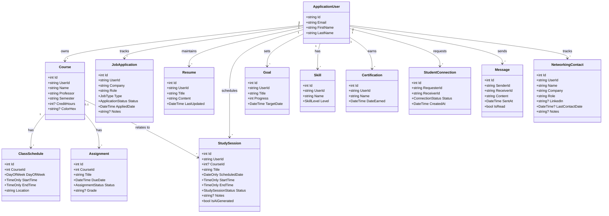

# PursuitHQ — Technical & Database Design

This document describes every class (entity) in PursuitHQ's backend, how they relate to each other, and the supporting layers (DTOs, Services, Data) that sit around them. It reflects the current planned feature set: authentication, academic planning, internship/job tracking, an AI-assisted resume builder, an AI-assisted study planner, career growth tracking, and student-to-student networking.

## 1. Entity Descriptions

### ApplicationUser *(extends ASP.NET Core Identity's `IdentityUser`)*

The central identity for every student account. Authentication (registration, login, password hashing) is handled by ASP.NET Core Identity itself — this class only adds the extra fields PursuitHQ needs.

| Property | Type | Notes |
|---|---|---|
| Id | string (GUID) | Provided by Identity |
| Email | string | Provided by Identity |
| PasswordHash | string | Provided by Identity, managed automatically |
| FirstName | string | Custom addition |
| LastName | string | Custom addition |

Every other entity below that belongs to a specific student has a `UserId` (string) foreign key pointing at `ApplicationUser.Id`.

### Course

| Property | Type | Notes |
|---|---|---|
| Id | int | |
| UserId | string | FK → ApplicationUser |
| Name | string | |
| Professor | string | |
| Semester | string | e.g. "Fall 2026" |
| CreditHours | int? | Optional |
| ColorHex | string? | Optional, used to color-code the calendar |

### ClassSchedule

Represents one recurring weekly meeting time for a course. A single `Course` can have multiple `ClassSchedule` rows (e.g. a class that meets Monday and Wednesday at different rooms).

| Property | Type | Notes |
|---|---|---|
| Id | int | |
| CourseId | int | FK → Course |
| DayOfWeek | enum (`DayOfWeek`) | |
| StartTime | TimeOnly | |
| EndTime | TimeOnly | |
| Location | string | |

### Assignment

| Property | Type | Notes |
|---|---|---|
| Id | int | |
| CourseId | int | FK → Course |
| Title | string | |
| DueDate | DateTime | |
| Status | enum (`AssignmentStatus`: NotStarted, InProgress, Completed) | |
| Grade | string? | Optional, filled in after graded |

### JobApplication *(covers both internships and full-time/part-time jobs)*

| Property | Type | Notes |
|---|---|---|
| Id | int | |
| UserId | string | FK → ApplicationUser |
| Company | string | |
| Role | string | |
| Type | enum (`JobType`: Internship, PartTime, FullTime) | |
| Status | enum (`ApplicationStatus`: Saved, Applied, Interview, Offer, Rejected) | |
| AppliedDate | DateTime | |
| Notes | string? | |

### Resume

One record per resume version a student maintains. Content is stored as a single structured field rather than many normalized tables, which keeps this simple now and makes it easy to hand the whole thing to an AI service for editing.

| Property | Type | Notes |
|---|---|---|
| Id | int | |
| UserId | string | FK → ApplicationUser |
| Title | string | e.g. "Software Engineering Resume" |
| Content | string (JSON or structured text) | Sections: experience, education, skills, projects, etc. |
| LastUpdated | DateTime | |

### StudySession

| Property | Type | Notes |
|---|---|---|
| Id | int | |
| UserId | string | FK → ApplicationUser |
| CourseId | int? | Optional FK → Course |
| Title | string | |
| ScheduledDate | DateOnly | |
| StartTime | TimeOnly | |
| EndTime | TimeOnly | |
| Status | enum (`StudySessionStatus`: Planned, Completed, Skipped) | |
| Notes | string? | |
| IsAiGenerated | bool | True if created by the AI study planner rather than the student |

### Goal

| Property | Type | Notes |
|---|---|---|
| Id | int | |
| UserId | string | FK → ApplicationUser |
| Title | string | |
| Progress | int | 0–100 |
| TargetDate | DateTime | |

### Skill

| Property | Type | Notes |
|---|---|---|
| Id | int | |
| UserId | string | FK → ApplicationUser |
| Name | string | |
| Level | enum (`SkillLevel`: Beginner, Intermediate, Advanced) | |

### Certification

| Property | Type | Notes |
|---|---|---|
| Id | int | |
| UserId | string | FK → ApplicationUser |
| Name | string | |
| DateEarned | DateTime | |

### StudentConnection

Represents a connection (like a friend/follow request) between two students.

| Property | Type | Notes |
|---|---|---|
| Id | int | |
| RequesterId | string | FK → ApplicationUser |
| ReceiverId | string | FK → ApplicationUser |
| Status | enum (`ConnectionStatus`: Pending, Accepted, Declined) | |
| CreatedAt | DateTime | |

### Message

Direct messages between connected students.

| Property | Type | Notes |
|---|---|---|
| Id | int | |
| SenderId | string | FK → ApplicationUser |
| ReceiverId | string | FK → ApplicationUser |
| Content | string | |
| SentAt | DateTime | |
| IsRead | bool | |

### NetworkingContact *(pending decision — see Open Questions)*

Originally planned for tracking **external** professional contacts (recruiters, alumni, LinkedIn connections), separate from in-app student-to-student networking above.

| Property | Type | Notes |
|---|---|---|
| Id | int | |
| UserId | string | FK → ApplicationUser |
| Name | string | |
| Company | string | |
| Role | string | |
| LinkedIn | string? | |
| LastContactDate | DateTime? | |
| Notes | string? | |

## 2. UML Class Diagram



## 3. DTO Pattern

Controllers should never accept or return the raw EF Core entities directly — that risks exposing internal fields (like `UserId`, which should always come from the authenticated user's token, never from client input) and makes it hard to change the database without breaking the API contract.

The pattern used throughout PursuitHQ: for each entity, define a matching pair of DTOs in the `DTOs` folder. Example for `Course`:

```csharp
// DTOs/CourseDto.cs — what the API returns
public class CourseDto
{
    public int Id { get; set; }
    public string Name { get; set; } = string.Empty;
    public string Professor { get; set; } = string.Empty;
    public string Semester { get; set; } = string.Empty;
}

// DTOs/CreateCourseDto.cs — what the client sends to create one
public class CreateCourseDto
{
    public string Name { get; set; } = string.Empty;
    public string Professor { get; set; } = string.Empty;
    public string Semester { get; set; } = string.Empty;
}
```

Notice `UserId` never appears in either DTO — the controller reads the current user's id from their authentication token and sets it on the entity itself.

## 4. Services Layer

| Service | Responsibility |
|---|---|
| Identity's `UserManager` / `SignInManager` | Registration, login, password management (built into ASP.NET Core Identity — no custom auth service needed) |
| `ResumeAiService` | Sends a student's `Resume.Content` to an AI API and returns suggested edits |
| `StudyPlannerAiService` | Reads a student's `Course`, `Assignment`, and existing `StudySession` data; generates suggested `StudySession` rows (`IsAiGenerated = true`) |

Additional services can be added as needed (e.g. a notification/reminder service later), but these three cover everything currently planned.

## 5. Data Layer

```csharp
public class ApplicationDbContext : IdentityDbContext<ApplicationUser>
{
    public DbSet<Course> Courses { get; set; }
    public DbSet<ClassSchedule> ClassSchedules { get; set; }
    public DbSet<Assignment> Assignments { get; set; }
    public DbSet<JobApplication> JobApplications { get; set; }
    public DbSet<Resume> Resumes { get; set; }
    public DbSet<StudySession> StudySessions { get; set; }
    public DbSet<Goal> Goals { get; set; }
    public DbSet<Skill> Skills { get; set; }
    public DbSet<Certification> Certifications { get; set; }
    public DbSet<StudentConnection> StudentConnections { get; set; }
    public DbSet<Message> Messages { get; set; }
    public DbSet<NetworkingContact> NetworkingContacts { get; set; }
}
```

## 6. Folder / Namespace Structure

```
PursuitHQ.API
├── Controllers      (one controller per entity, e.g. CoursesController)
├── Models           (the entity classes described in Section 1)
├── DTOs             (request/response shapes per Section 3)
├── Services         (ResumeAiService, StudyPlannerAiService, etc.)
├── Data             (ApplicationDbContext)
└── Migrations       (EF Core migrations, generated automatically)
```

## 7. Suggested Build Order

1. **ApplicationUser + Identity setup** — everything else has a `UserId` FK, so auth comes first.
2. **Course, ClassSchedule, Assignment** — Academic Planner (Sprint 3–4 in Roadmap.md).
3. **JobApplication** — Internship Tracker (Sprint 6).
4. **Goal, Skill, Certification** — Career Growth (Sprint 5, 7).
5. **StudentConnection, Message** — Networking Hub (Sprint 9).
6. **Resume + ResumeAiService** — AI resume builder (Sprint 8+).
7. **StudySession + StudyPlannerAiService** — AI study planner (Sprint 8+).
8. **NetworkingContact** — only if you decide to keep it (see below).

## 8. Open Questions

- **NetworkingContact**: keep as a separate feature for tracking external professional contacts, or drop it and focus only on in-app student-to-student networking (`StudentConnection` / `Message`)?
