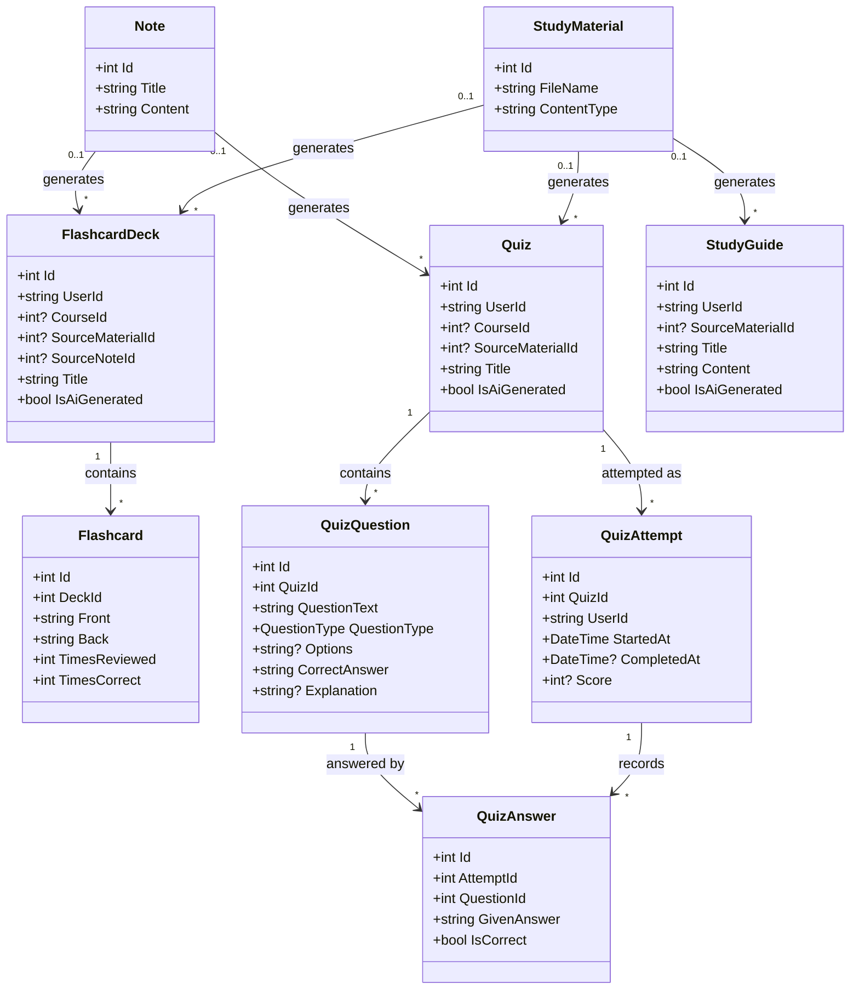

# PursuitHQ — Technical & Database Design

This document describes every class (entity) in PursuitHQ's backend, how they relate to each other, and the supporting layers (DTOs, Services, Data) that sit around them. It reflects the current planned feature set: authentication, academic planning, per-course study materials (files, folders, and typed notes), AI study tools (flashcards, quizzes, study guides), email reminders, internship/job search and tracking, an AI-assisted resume builder, an AI-assisted study planner, and career growth tracking.

## 1. Entity Descriptions

### ApplicationUser *(extends ASP.NET Core Identity's `IdentityUser`)*

The central identity for every student account. Authentication (registration, login, password hashing) is handled by ASP.NET Core Identity itself — this class only adds the extra fields PursuitHQ needs.

| Property | Type | Notes |
|---|---|---|
| Id | string (GUID) | Provided by Identity |
| Email | string | Provided by Identity |
| PasswordHash | string | Provided by Identity, managed automatically |
| FirstName | string | Custom addition |
| LastName | string | Custom addition |

Every other entity below that belongs to a specific student has a `UserId` (string) foreign key pointing at `ApplicationUser.Id`.

### Course

| Property | Type | Notes |
|---|---|---|
| Id | int | |
| UserId | string | FK → ApplicationUser |
| Name | string | |
| Professor | string | |
| Semester | string | e.g. "Fall 2026" |
| CreditHours | int? | Optional |
| ColorHex | string? | Optional, used to color-code the calendar |

### ClassSchedule

Represents one recurring weekly meeting time for a course. A single `Course` can have multiple `ClassSchedule` rows (e.g. a class that meets Monday and Wednesday at different rooms).

| Property | Type | Notes |
|---|---|---|
| Id | int | |
| CourseId | int | FK → Course |
| DayOfWeek | enum (`DayOfWeek`) | |
| StartTime | TimeOnly | |
| EndTime | TimeOnly | |
| Location | string | |

### CalendarEvent

Anything on a student's calendar that is not a class meeting, an assignment due date, or a study session: work shifts, club meetings, appointments, personal events.

| Property | Type | Notes |
|---|---|---|
| Id | int | |
| UserId | string | FK -> ApplicationUser |
| Title | string | |
| Description | string? | |
| StartDateTime | DateTime | |
| EndDateTime | DateTime | |
| Location | string? | |
| EventType | enum (`EventType`: Work, Club, Appointment, Personal, Other) | |
| IsRecurring | bool | |
| RecurrenceRule | string? | iCal RRULE string, e.g. `FREQ=WEEKLY;BYDAY=TU,TH` |
| ColorHex | string? | |

The calendar view is the union of four sources: `ClassSchedule` (recurring class times), `Assignment` (due dates), `StudySession` (planned study blocks), and `CalendarEvent` (everything else).

### Assignment

| Property | Type | Notes |
|---|---|---|
| Id | int | |
| CourseId | int | FK → Course |
| Title | string | |
| DueDate | DateTime | |
| Status | enum (`AssignmentStatus`: NotStarted, InProgress, Completed) | |
| Grade | string? | Optional, filled in after graded |

### MaterialFolder

A folder inside a course, used to organize study materials like a file system. Folders can nest via `ParentFolderId` (null means it sits at the course root).

| Property | Type | Notes |
|---|---|---|
| Id | int | |
| UserId | string | FK -> ApplicationUser |
| CourseId | int | FK -> Course |
| Name | string | |
| ParentFolderId | int? | Self-referencing FK -> MaterialFolder; null = course root |
| CreatedAt | DateTime | |

### StudyMaterial

Metadata for one uploaded file. The file bytes live in storage (local disk in development, cloud object storage in production); only the metadata lives in PostgreSQL.

| Property | Type | Notes |
|---|---|---|
| Id | int | |
| UserId | string | FK -> ApplicationUser |
| CourseId | int | FK -> Course |
| FolderId | int? | FK -> MaterialFolder; null = course root |
| FileName | string | Original name shown to the user and used on download |
| StoredPath | string | Internal storage key (a GUID-based name), never exposed to the client |
| ContentType | string | MIME type, validated against the allow-list |
| SizeBytes | long | |
| Description | string? | Optional |
| UploadedAt | DateTime | |

### Note

A note typed directly in the app, stored as text rather than an uploaded file.

| Property | Type | Notes |
|---|---|---|
| Id | int | |
| UserId | string | FK -> ApplicationUser |
| CourseId | int | FK -> Course |
| FolderId | int? | FK -> MaterialFolder; null = course root |
| Title | string | |
| Content | string | Markdown or plain text |
| CreatedAt | DateTime | |
| UpdatedAt | DateTime | |

### NotificationPreference

One row per student controlling whether and when reminders are emailed. Created with defaults at registration.

| Property | Type | Notes |
|---|---|---|
| Id | int | |
| UserId | string | FK -> ApplicationUser, unique |
| EmailEnabled | bool | Master on/off switch |
| AssignmentRemindersEnabled | bool | |
| AssignmentReminderHoursBefore | int | e.g. 24 or 48 hours before a due date |
| EventRemindersEnabled | bool | Reminders for calendar events and classes |
| EventReminderMinutesBefore | int | e.g. 30 minutes before |
| DailyDigestEnabled | bool | A single morning summary email |
| DailyDigestTime | TimeOnly | Local time to send the digest, e.g. 07:00 |
| WeeklyDigestEnabled | bool | Sunday-evening week-ahead summary |
| TimeZone | string | IANA id, e.g. `America/New_York` — required so reminders arrive at the right local time |

### Notification

A record of every email actually sent. Prevents duplicate sends and gives the student a history.

| Property | Type | Notes |
|---|---|---|
| Id | int | |
| UserId | string | FK -> ApplicationUser |
| Type | enum (`NotificationType`: AssignmentDue, EventReminder, DailyDigest, WeeklyDigest) | |
| RelatedEntityType | string? | e.g. `Assignment` |
| RelatedEntityId | int? | Together with the above, prevents sending the same reminder twice |
| Subject | string | |
| SentAt | DateTime | |
| Status | enum (`DeliveryStatus`: Sent, Failed) | |
| ErrorMessage | string? | |

Note: the email body is not stored, only the subject — bodies can contain assignment titles and other private content, and storing them adds risk without adding value.

### JobApplication *(covers both internships and full-time/part-time jobs)*

| Property | Type | Notes |
|---|---|---|
| Id | int | |
| UserId | string | FK → ApplicationUser |
| Company | string | |
| Role | string | |
| Type | enum (`JobType`: Internship, PartTime, FullTime) | |
| Status | enum (`ApplicationStatus`: Saved, Applied, Interview, Offer, Rejected) | |
| AppliedDate | DateTime | |
| Notes | string? | |
| Source | enum (`ApplicationSource`: Manual, Search) | How the application entered the tracker |
| ExternalJobId | string? | Id from the job-search provider, if sourced from search |
| SourceUrl | string? | Direct link to the original posting, used by the "Apply" button |

### Resume

One record per resume version a student maintains. Content is stored as a single structured field rather than many normalized tables, which keeps this simple now and makes it easy to hand the whole thing to an AI service for editing.

| Property | Type | Notes |
|---|---|---|
| Id | int | |
| UserId | string | FK → ApplicationUser |
| Title | string | e.g. "Software Engineering Resume" |
| Content | string (JSON or structured text) | Sections: experience, education, skills, projects, etc. |
| LastUpdated | DateTime | |

### StudySession

| Property | Type | Notes |
|---|---|---|
| Id | int | |
| UserId | string | FK → ApplicationUser |
| CourseId | int? | Optional FK → Course |
| Title | string | |
| ScheduledDate | DateOnly | |
| StartTime | TimeOnly | |
| EndTime | TimeOnly | |
| Status | enum (`StudySessionStatus`: Planned, Completed, Skipped) | |
| Notes | string? | |
| IsAiGenerated | bool | True if created by the AI study planner rather than the student |

### FlashcardDeck / Flashcard

A deck of flashcards, generated by AI from an uploaded file or a note, or created by hand.

**FlashcardDeck**

| Property | Type | Notes |
|---|---|---|
| Id | int | |
| UserId | string | FK -> ApplicationUser |
| CourseId | int? | FK -> Course |
| SourceMaterialId | int? | FK -> StudyMaterial, if generated from an upload |
| SourceNoteId | int? | FK -> Note, if generated from a typed note |
| Title | string | |
| IsAiGenerated | bool | |
| CreatedAt | DateTime | |

**Flashcard**

| Property | Type | Notes |
|---|---|---|
| Id | int | |
| DeckId | int | FK -> FlashcardDeck |
| Front | string | Question / term |
| Back | string | Answer / definition |
| Order | int | |
| TimesReviewed | int | |
| TimesCorrect | int | Supports "study the ones I keep missing" |

### Quiz / QuizQuestion / QuizAttempt / QuizAnswer

An AI-generated practice quiz and the student's attempts at it.

**Quiz**

| Property | Type | Notes |
|---|---|---|
| Id | int | |
| UserId | string | FK -> ApplicationUser |
| CourseId | int? | FK -> Course |
| SourceMaterialId | int? | FK -> StudyMaterial |
| SourceNoteId | int? | FK -> Note |
| Title | string | |
| IsAiGenerated | bool | |
| CreatedAt | DateTime | |

**QuizQuestion**

| Property | Type | Notes |
|---|---|---|
| Id | int | |
| QuizId | int | FK -> Quiz |
| QuestionText | string | |
| QuestionType | enum (`QuestionType`: MultipleChoice, TrueFalse, ShortAnswer) | |
| Options | string? | JSON array of choices, for multiple choice |
| CorrectAnswer | string | |
| Explanation | string? | Shown after answering |
| Order | int | |

**QuizAttempt**

| Property | Type | Notes |
|---|---|---|
| Id | int | |
| QuizId | int | FK -> Quiz |
| UserId | string | FK -> ApplicationUser |
| StartedAt | DateTime | |
| CompletedAt | DateTime? | |
| Score | int? | Percentage correct |

**QuizAnswer**

| Property | Type | Notes |
|---|---|---|
| Id | int | |
| AttemptId | int | FK -> QuizAttempt |
| QuestionId | int | FK -> QuizQuestion |
| GivenAnswer | string | |
| IsCorrect | bool | |

### StudyGuide

A condensed, structured summary generated from one or more uploaded files (e.g. a set of lecture slides).

| Property | Type | Notes |
|---|---|---|
| Id | int | |
| UserId | string | FK -> ApplicationUser |
| CourseId | int? | FK -> Course |
| SourceMaterialId | int? | FK -> StudyMaterial |
| SourceNoteId | int? | FK -> Note |
| Title | string | |
| Content | string | Markdown |
| IsAiGenerated | bool | |
| CreatedAt | DateTime | |

### Goal

| Property | Type | Notes |
|---|---|---|
| Id | int | |
| UserId | string | FK → ApplicationUser |
| Title | string | |
| Progress | int | 0–100 |
| TargetDate | DateTime | |

### Skill

| Property | Type | Notes |
|---|---|---|
| Id | int | |
| UserId | string | FK → ApplicationUser |
| Name | string | |
| Level | enum (`SkillLevel`: Beginner, Intermediate, Advanced) | |

### Certification

| Property | Type | Notes |
|---|---|---|
| Id | int | |
| UserId | string | FK → ApplicationUser |
| Name | string | |
| DateEarned | DateTime | |

## 2. UML Class Diagrams

The model is split across three diagrams so each stays readable. Together they cover every entity in Section 1.

### 2.1 Core domain — accounts, academics, career


### 2.2 AI study tools



## 3. DTO Pattern

Controllers should never accept or return the raw EF Core entities directly — that risks exposing internal fields (like `UserId`, which should always come from the authenticated user's token, never from client input) and makes it hard to change the database without breaking the API contract.

The pattern used throughout PursuitHQ: for each entity, define a matching pair of DTOs in the `DTOs` folder. Example for `Course`:

```csharp
// DTOs/CourseDto.cs — what the API returns
public class CourseDto
{
    public int Id { get; set; }
    public string Name { get; set; } = string.Empty;
    public string Professor { get; set; } = string.Empty;
    public string Semester { get; set; } = string.Empty;
}

// DTOs/CreateCourseDto.cs — what the client sends to create one
public class CreateCourseDto
{
    public string Name { get; set; } = string.Empty;
    public string Professor { get; set; } = string.Empty;
    public string Semester { get; set; } = string.Empty;
}
```

Notice `UserId` never appears in either DTO — the controller reads the current user's id from their authentication token and sets it on the entity itself.

## 4. Services Layer

| Service | Responsibility |
|---|---|
| Identity's `UserManager` / `SignInManager` | Registration, login, password management (built into ASP.NET Core Identity — no custom auth service needed) |
| `ResumeAiService` | Sends a student's `Resume.Content` to an AI API and returns suggested edits |
| `IFileStorageService` / `LocalFileStorageService` | Saves, streams, and deletes uploaded files; keeps storage details out of controllers so the backend can move to cloud storage later |
| `ITextExtractionService` | Pulls plain text out of uploaded PDF, DOCX, and PPTX files so it can be fed to the AI study tools |
| `StudyToolAiService` | Generates flashcards, quiz questions, and study guides from extracted text |
| `IEmailService` / `ResendEmailService` | Sends reminder and digest emails |
| `NotificationService` | Decides who is due a reminder, renders the email, records it in `Notification` |
| `JobSearchService` | Queries the external job-board API and maps results into search hits |
| `StudyPlannerAiService` | Reads a student's `Course`, `Assignment`, and existing `StudySession` data; generates suggested `StudySession` rows (`IsAiGenerated = true`) |

Additional services can be added as needed (e.g. a notification/reminder service later), but these three cover everything currently planned.

## 5. Data Layer

```csharp
public class ApplicationDbContext : IdentityDbContext<ApplicationUser>
{
    public DbSet<Course> Courses { get; set; }
    public DbSet<ClassSchedule> ClassSchedules { get; set; }
    public DbSet<Assignment> Assignments { get; set; }
    public DbSet<CalendarEvent> CalendarEvents { get; set; }
    public DbSet<NotificationPreference> NotificationPreferences { get; set; }
    public DbSet<Notification> Notifications { get; set; }
    public DbSet<FlashcardDeck> FlashcardDecks { get; set; }
    public DbSet<Flashcard> Flashcards { get; set; }
    public DbSet<Quiz> Quizzes { get; set; }
    public DbSet<QuizQuestion> QuizQuestions { get; set; }
    public DbSet<QuizAttempt> QuizAttempts { get; set; }
    public DbSet<QuizAnswer> QuizAnswers { get; set; }
    public DbSet<StudyGuide> StudyGuides { get; set; }
    public DbSet<MaterialFolder> MaterialFolders { get; set; }
    public DbSet<StudyMaterial> StudyMaterials { get; set; }
    public DbSet<Note> Notes { get; set; }
    public DbSet<JobApplication> JobApplications { get; set; }
    public DbSet<Resume> Resumes { get; set; }
    public DbSet<StudySession> StudySessions { get; set; }
    public DbSet<Goal> Goals { get; set; }
    public DbSet<Skill> Skills { get; set; }
    public DbSet<Certification> Certifications { get; set; }
}
```

## 6. Folder / Namespace Structure

```
PursuitHQ.API
├── Controllers      (one controller per entity, e.g. CoursesController)
├── Models           (the entity classes described in Section 1)
├── DTOs             (request/response shapes per Section 3)
├── Services         (ResumeAiService, StudyPlannerAiService, etc.)
├── Data             (ApplicationDbContext)
└── Migrations       (EF Core migrations, generated automatically)
```

## 7. Suggested Build Order

1. **ApplicationUser + Identity setup** — everything else has a `UserId` FK, so auth comes first.
2. **Course, ClassSchedule, Assignment** — Academic Planner (Sprint 3–4 in Roadmap.md).
3. **MaterialFolder, StudyMaterial, Note** — Study Materials, plus `IFileStorageService` (see Architecture.md).
4. **CalendarEvent** — non-class calendar entries.
5. **NotificationPreference, Notification** — email reminders (needs `IEmailService` and an external scheduler; see Architecture.md).
6. **JobApplication** — Internship Tracker, then job search integration.
7. **Goal, Skill, Certification** — Career Growth (Sprint 5, 7).
8. **Resume + ResumeAiService** — AI resume builder (Sprint 8+).
9. **StudySession + StudyPlannerAiService** — AI study planner (Sprint 8+).
10. **FlashcardDeck, Flashcard, Quiz, QuizQuestion, QuizAttempt, QuizAnswer, StudyGuide** — AI study tools, plus `ITextExtractionService` and `StudyToolAiService`.
